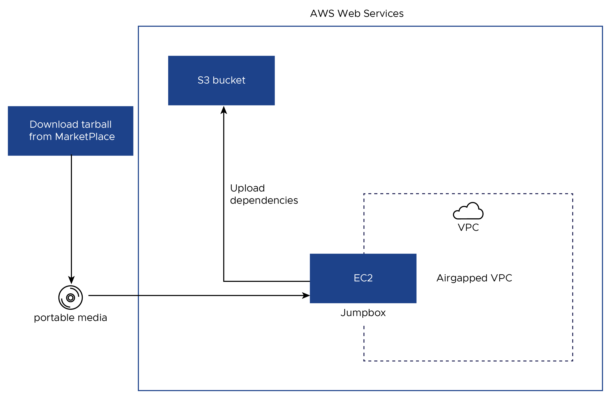
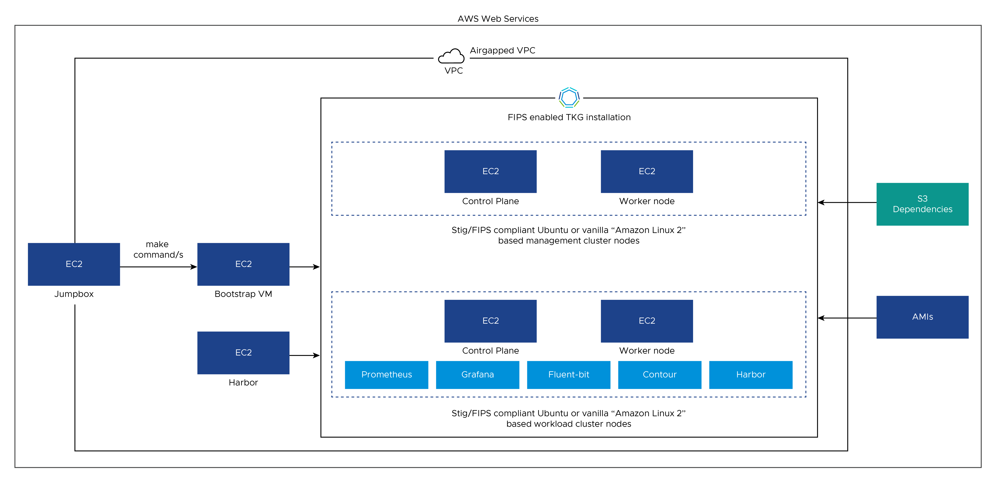
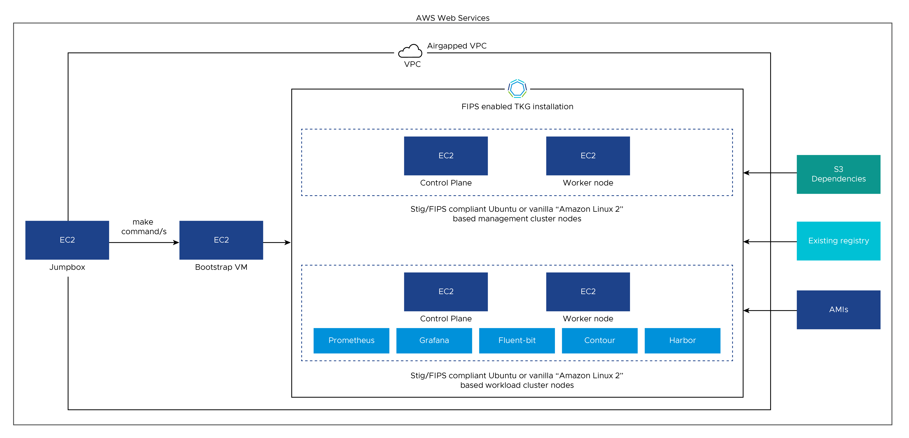

# Deploying Tanzu for Kubernetes Operations on Federal Air-gapped AWS VPC Using Service Installer for VMware Tanzu

Service Installer for VMware Tanzu (SIVT) enables you to install Tanzu for Kubernetes Operations in a federal air-gapped (internet restricted) AWS VPC with the help of easily transportable binaries and TAR files and Terraform automation scripts. The deployed platform is STIG hardened and FIPS compliant.

**Note:** In this deployment procedure, a federal air-gapped environment refers to an internet-restricted environment that is compliant with standards such as FIPS and STIG.

Service Installer for VMware Tanzu deploys the following Tanzu components:

- Tanzu Kubernetes Grid management cluster
- Tanzu Kubernetes Grid workload cluster
- User managed packages: Harbor, Prometheus, Grafana, Fluent Bit, and Pinniped with LDAP identity management.

This document provides the steps to deploy Tanzu Kubernetes Grid on air-gapped AWS environment using Service Installer for VMware Tanzu.

## Prerequisites

Before deploying Tanzu Kubernetes Grid on AWS using Service Installer for VMware Tanzu (SIVT), ensure that the following are set up.

- A pre-existing air-gapped Virtual Private Cloud (VPC) in AWS. This AWS VPC should have VPC endpoints of type interface unless otherwise specified, enabled to allow access within the VPC to the following AWS services:
    - sts
    - ssm
    - ec2
    - ec2messages
    - elasticloadbalancing
    - secretsmanager
    - ssmmessages
    - cloudformation
    - s3 (gateway type)

- An RSA SSH key pair created in the AWS region where Tanzu Kubernetes Grid needs to be deployed.

- An S3 bucket that is in the same AWS region as the air-gapped VPC with all of the Tanzu Kubernetes Grid dependencies required for the installation.
  
   - An S3 bucket policy is required for image building. Create a bucket policy on your AWS S3 bucket that allows access to the S3 bucket from within VPC through a VPC endpoint. Following is an example of the policy for S3 bucket:

     ```json
     {
      "Version": "2012-10-17",
      "Statement": [
        {
          "Sid": "Access-to-specific-VPCE-only",
          "Effect": "Allow",
          "Principal": "*",
          "Action": "s3:GetObject",
          "Resource": "arn:aws:s3:::<YOUR BUCKET NAME>/*",
          "Condition": {
            "StringEquals": {
            "aws:sourceVpce": "<YOUR VPC ENDPOINT ID>"
            }
          }
        }
      ]
     }
     ```

- The required binaries are uploaded to the S3 bucket.
  
    1. Download the TAR file `service-installer-for-AWS-Tanzu-with-Dependency-1.3.tar.gz` from the [VMware Marketplace](https://marketplace.cloud.vmware.com/services/details/service-installer-for-vmware-tanzu-1?slug=true), it contains Tanzu Kubernetes Grid or Tanzu Kubernetes releases (TKRs) binaries, Harbor, deployment dependencies and automation source code. This tar file can be used for following deployment usecases in airgap environment
          - To deploy Tanzu Kubernetes Grid using automation
          - To deploy Tanzu Kubernetes Grid manually by following RA and Deployment guide

    1. Copy the TAR file over to your air-gapped environment on a portable media.

    1. Extract the TAR file using the following command.
        ```sh
        cd ~/sivt_bits/                                      -> Change directory to the location of the TAR file. In this example, ~/sivt_bits/
        tar -xvf service-installer-for-AWS-Tanzu-with-Dependency-1.3.tar.gz     -> Extract TAR file contents to the `~/sivt_bits/airgap_deployment_binaries/` directory
        ```

    1. Change the directory to the Service Installer for VMware Tanzu codebase directory which is under the `airgap_deployment_binaries` directory and set the following variables:
        ```sh
        cd ~/sivt_bits/airgap_deployment_binaries/sivt-aws-federal/
        export BUCKET_NAME=MY-BUCKET
        export DEPS_DIR=MY-DEPENDENCY-DIRECTORY     -> This should point to the directory `~/sivt_bits/airgap_deployment_binaries`
        ```
    
    1. Run the following command to upload the binaries to the S3 bucket.
    
        **Note:** Before running this command, make sure that the present working directory is `~/sivt_bits/airgap_deployment_binaries/sivt-aws-federal/`_
        ```sh
        make upload-deps
        ```
  
    

- A Jumpbox VM with SSH access to the air-gapped environment that has the following components:
  - Docker
  - yq
  - awscli
  - jq
  - make(build-essentials)
  - terraform

  The following binaries are available as part of the TAR file and they get uploaded to S3 bucket in a prerequisite step. You do not need to install these binaries manually.
  - kind
  - goss
  - CAPI Image builder
  - docker-compose
  - Ubuntu OS apt-get repo
  - crashd

- Account used for deployment must have access to create CloudFormation along with policies, roles, or node profiles, security groups, EC2 instances, S3 bucket policies, and AMIs as well as create, get, and list access to the Tanzu Kubernetes Grid dependencies bucket (S3 bucket) mentioned previously.

- Bash shell support must be enabled as the shell scripts in the code use `/bin/bash`.

## Deployment Steps

**Note**: If you have completed all the steps in [Prerequisites](#prerequisites), skip to Step 3 as Step 1 and Step 2 of this section are covered in [Prerequisites](#prerequisites).

1. Copy the contents of the portable media created using the TAR file to the Jumpbox VM.

1. Copy dependencies to the AWS S3 bucket by executing the following commands inside the Federal SIVT AWS git repository.
    ```sh
    export BUCKET_NAME=<S3 Bucket in airgapped env>
    export DEPS_DIR=<Directory where dependencies are located> -> Should be set to 
                                                                  `<your_directory>/airgap_deployment_binaries`
    
    make upload-deps
    ```

1. Export the following environment variables.
    ```sh
    export BUCKET_NAME=<AWS S3 bucket name containing dependencies>
    export VPC_ID=<AirGapped VPC ID>
    export SUBNET_ID=<Private Subnet ID where Tanzu Kubernetes Gris will be installed>
    export SSH_KEY_NAME=<AWS RSA SSH key>
    export AWS_AZ_ZONE=<AWS AZ_ZONE>
    export AWS_ACCESS_KEY_ID=<AWS Access Key ID>
    export AWS_SECRET_ACCESS_KEY=<AWS Secret Access Key>
    export AWS_DEFAULT_REGION=<AWS Region where Tanzu Kubernetes Grid will be installed>
    export TKR_VERSION=<Tanzu Kubernetes Release Version>
    export TKG_VERSION=<Tanzu Kubernetes Grid Version>
    ```
    
    |TKG Version|TKr Version|FIPS ENABLED|
    |-----------|-----------|------------|
    |v1.5.3|v1.22.8|true|

    **Note**: If you do not want to use the default Harbor admin password, export the password using following command:
      ```sh
      export TF_VAR_harbor_pwd=<Custom Password for Harbor>
      ```
    
      If you are using CloudGate or any other third party gateway to access AWS, export `AWS_SESSION_TOKEN`. This is not needed if you are accessing AWS directly.
      ```sh
      export AWS_SESSION_TOKEN=<AWS session token>
      ```

1. If you plan to use an existing image registry, configure an existing registry by referring to [Using an Existing Registry](#using-an-existing-registry), otherwise skip this step.

    The script sets these values for Harbor, Prometheus, and Grafana extensions:

     ```sh
    HARBOR_HOSTNAME="harbor.system.tanzu"
    PROMETHEUS_HOSTNAME="prometheus.system.tanzu"
    GRAFANA_HOSTNAME="grafana.system.tanzu"
    HARBOR_PASSWORD="harbor123"
     ```
  
1. Use the following commands if you want to overwrite these values.
    ```sh
    export TF_VAR_harbor_host_name=<Hostname for Harbor>
    export TF_VAR_prometheus_host_name=<Hostname for Prometheus>
    export TF_VAR_grafana_host_name=<Hostname for Grafana>
    export TF_VAR_harbor_extension_password=<Password for Harbor>
    ```

1. Install Tanzu Kubernetes Grid extensions as follows.
    
    By default, the script installs cert_manager and Contour as part of the default installation. For installing other extensions, set the following variables to true.

    ```sh
    export HARBOR_DEPLOYMENT=true
    export PROMETHEUS_DEPLOYMENT=true
    export GRAFANA_DEPLOYMENT=true
    export FLUENT_BIT_DEPLOYMENT=true
    ```
    
    The installer resolves the prerequisites for extension deployments. For example: Grafana needs cert-manager, Contour, and Prometheus. The scripts install cert-manager, Contour, and Prometheus before Grafana installation if `GRAFANA_DEPLOYMENT` is set to `true`.

1. Enable Pinniped on management and workload clusters.
    
    By default, Pinniped is set to `false`. For enabling Pinniped on management and workload clusters, set the following variables:

      ```sh 
      export ENABLE_IDENTITY_MANAGEMENT=true
      export IDENTITY_MANAGEMENT_TYPE=ldap
      export LDAP_HOST= <The IP or DNS address of your LDAP server>
      export LDAP_USER_SEARCH_BASE_DN=<The point from which to start the LDAP search>
      export LDAP_GROUP_SEARCH_BASE_DN=<The point from which to start the LDAP search>
      ```

   For more information on these variables, see [Tanzu CLI Configuration File Variable Reference](https://docs.vmware.com/en/VMware-Tanzu-Kubernetes-Grid/1.5/vmware-tanzu-kubernetes-grid-15/GUID-tanzu-config-reference.html).

1. Install Tanzu Kubernetes Grid.
    
    **Note**: Once you extract the TAR bundle downloaded in [Prerequisites](#prerequisites), make sure that you are in the `<your_directory>/airgap_deployment_binaries/sivt-aws-federal/` directory while running make commands.
    
    To get the list of all the make command targets, run the following command:
    ```sh
      make
    ```

    For installing Tanzu Kubernetes Grid, run the following set of commands based on your use case:
    
    - **Use case 1** : End-to-End deployment using ubuntu based STIG compliant OS
        
        To install Tanzu Kubernetes Grid on native AWS air-gapped environment with Ubuntu OS which is STIG or FIPS compliant and Tanzu Kubernetes Grid is FIPS enabled, Core Kubernetes components are hardened using overlays. Run the following command.

      ```sh 
      make all
      ```
  
    - **Use case 2** : Modular step-by-step deployment using Ubuntu based STIG compliant OS
        
        If a few of the steps in the deployment need manual intervention such as creation of roles, policies, or profiles and Harbor installation, then run the following commands in the given order. Skip the step which is performed manually.

      **Note**: The detailed description of individual steps is given in the [Make Targets](#make-targets) section.

      ```sh
      make verify-all-inputs 
      make vpc-endpoints-prechecks
      make cf
      make install-harbor 
      make check-for-ca-download
      make setup-docker
      make tkg-bootstrap-ami-offline
      make stig-ami-offline 
      make install
      ```
    
    - **Use case 3** : Modular step-by-step deployment using Amazon Linux 2 OS
        
        If a few of the steps in the deployment need manual intervention such as creation of roles, policies, or profiles and Harbor installation, then run the following commands in the given order. Skip the step which is performed manually.
        
      **Note** The detailed description of individual steps is given in the [Make Targets](#make-targets) section.

      ```sh
      make verify-all-inputs 
      make vpc-endpoints-prechecks
      make cf 
      make install-harbor 
      make check-for-ca-download 
      make setup-docker 
      make al2-bootstrap-ami-offline 
      make al2-node-ami-offline 
      make install-tkg-on-al2
      ```

## Make Targets

**Note:** Prerequisites mentioned in this table are applicable only if you are not using `make all` or if you are not following the step by step process.

  |CLI Parameter| Description|Prerequisites|
  |--------|--------|--------|
  |all|End-to-End deployment using Ubuntu based STIG compliant OS|NA|
  |verify-all-inputs|Check all the inputs mentioned in [Deployment Steps](#deployment-steps) are set. Script mainly checks for mandatory variables|NA|
  |vpc-endpoints-prechecks|Check if all the required endpoints mentioned in the [prerequisites](#prerequisites) section are attached to air-gapped VPC|Make sure all the mentioned endpoints are attached to VPC|
  |cf|Make Cloud Formation if it doesn't exist along with roles, policies or profiles. Refer [AWS IAM components created by cf](#aws-iam-components-created-by-cf) section for more details|NA|
  |install-harbor|If you are using a pre-created registry then refer to [Using an Existing Registry](#using-an-existing-registry) for details. Else, this step deploys Harbor on a new EC2 instance through Terraform. After the successful installation of Harbor, CA certificate is copied to the S3 bucket which is be used in the further steps.|Make sure IAM profile names `tkg-s3-viewer` and roles and policies are created according to the information in the [AWS IAM components created by cf](#aws-iam-components-created-by-cf) section|
  |check-for-ca-download|Checks and downloads the CA certificate generated by the `install-harbor` step. If the CA certificate is not available in S3, this step waits for a maximum of 1 hour.  The CA certificate gets copied to S3 after successful installation of Harbor.|If you are using pre-created registry then refer to [Using an Existing Registry](#using-an-existing-registry) for details. Else, run `make install-harbor` command before running this command.|
  |setup-docker|Sets up local Docker with the downloaded Harbor CA certificate| Make sure these steps are done:<br/>1. Harbor is up and running. <br/>2. `check-for-ca-download` is performed.|
  |tkg-bootstrap-ami-offline|Builds Ubuntu based bootstrap AMI| Make sure these steps are done:<br/>1. Make sure Harbor is up and running.<br/>2. `check-for-ca-download` and `setup-docker` are performed.|
  |stig-ami-offline|Builds Ubuntu based STIG compliant node AMI| Make sure these steps are done:<br/> 1. Make sure Harbor is up and running.<br/>2. `check-for-ca-download` and `setup-docker` are performed.|
  |install|Deploys bootstrap on EC2 instance and deploys management and workload clusters on top of Ubuntu based STIG compliant node AMI|  Make sure these steps are done:<br/>1. Make sure Harbor is up and running.<br/>2. `check-for-ca-download` and `setup-docker` are performed.<br/>3. Bootstrap AMI and STIG AMIs are created. |
  |al2-node-ami-offline|Builds Amazon linux2 AMIs for Tanzu Kubernetes Grid clusters|Make sure these steps are done:<br/>1. Make sure Harbor is up and running.<br/>2. `check-for-ca-download` and `setup-docker` are performed.|
  |al2-bootstrap-ami-offline|Builds Amazon linux2 AMIs for bootstrap|Make sure these steps are done:<br/>1. Make sure Harbor is up and running.<br/>2. `check-for-ca-download` and `setup-docker` are performed. |
  |install-tkg-on-al2|Installs Tanzu Kubernetes Grid on AWS, considering Amazon Linux 2 as base OS for Bootstrap and TKG clusters|Make sure these steps are done: <br/>1. Make sure Harbor is up and running.<br/>2. `check-for-ca-download` and `setup-docker` are performed.<br/>3. Bootstrap AMI and STIG AMIs are created.|

The entire setup that is brought up by the automation code: 

  

### AWS IAM Components Created by cf

The `make cf` command creates the following instance profiles, roles, and policies. If you are manually creating instance profiles, roles, and policies, ensure that the following are created and they are given the same names as in this table.

**Note:** For more information on role and their detailed actions, see the [cloud-formation-iamtemplate](https://gitlab.eng.vmware.com/core-build/sivt-aws-federal/-/blob/main/cloud-formation-iamtemplate) file.

|Profile|Roles|Policies|
|-------|-----|--------|
|control-plane.tkg.cloud.vmware.com|control-plane.tkg.cloud.vmware.com|control-plane.tkg.cloud.vmware.com <br/>controllers.tkg.cloud.vmware.com<br/>nodes.tkg.cloud.vmware.com|
|controllers.tkg.cloud.vmware.com|controllers.tkg.cloud.vmware.com|controllers.tkg.cloud.vmware.com|
|nodes.tkg.cloud.vmware.com|nodes.tkg.cloud.vmware.com|nodes.tkg.cloud.vmware.com|
|tkg-s3-viewer|tkg-s3-role|tkg-airgapped-bucket|
|tkg-bootstrap|tkg-bootstrap|tkg-airgapped-bucket<br/>nodes.tkg.cloud.vmware.com<br/>controllers.tkg.cloud.vmware.com<br/>control-plane.tkg.cloud.vmware.com|

## Customizing Harbor
By default, Harbor is installed on an Amazon 2 AMI because it needs the Amazon CLI to pull the dependencies from the Tanzu Kubernetes Grid dependencies bucket and it also requires the ability to install Docker in an air-gapped environment.

  - These environment variables can be set to change Harbor's default behavior:
      ```sh
      export TF_VAR_create_certs = <Default is true>
      ```

  - If `TF_VAR_create_certs` is `true`, which is the default, the following variables must be set:
      ```sh
      export TF_VAR_cert_l=#Default Minneapolis| L in the certs cn(Location)
      export TF_VAR_cert_st=#Default Minnesota|ST in the certs CN(State)
      export TF_VAR_cert_o=#Default VmWare|O in the certs CN(Organization)
      export TF_VAR_cert_ou=#Default VmWare R&D|OU in the certs CN(Organizational Unit)
      ```

  - Else, if `TF_VAR_create_certs` is `false`, the following variables must be set:
      ```sh
      export TF_VAR_cert_path=#Path to certificate on harbor ami
      export TF_VAR_cert_key_path=#Path to private key on harbor ami
      export TF_VAR_cert_ca_path=#Path to ca certificate on harbor ami
      ```

## Customizing AMIs

This section describes the process of customizing the Ubuntu AMIs created in the deployment. The AMIs are created using the VPC ID and subnet ID of your air-gapped VPC.

  - **Disable FIPS**: To disable FIPS, set `install_fips` to `no` in the [STIG roles' main.yml](https://gitlab.eng.vmware.com/core-build/canonical-ubuntu-18.04-lts-stig-hardening/-/blob/master/vars/main.yml) file.

  - **Add CA certificate in the trust store**: To add CA certificates to the AMI, copy the CAs in `PEM` format to the [STIG roles' files/ca](https://gitlab.eng.vmware.com/core-build/canonical-ubuntu-18.04-lts-stig-hardening/-/tree/master/files/ca) folder.

## Customizing Tanzu Kubernetes Grid

All configurable options and their default values can be seen in the
[terraform/startup.sh](https://gitlab.eng.vmware.com/core-build/sivt-aws-federal/-/tree/main/terraform) file. The variables must be edited in this file for them to take effect because Terraform is not configured to take all of them as input.

For a description of all variables, see the [Variables](#variables) section.

## Accessing Your Harbor Instance

  - Once Terrafrom finishes applying the resources, if VPC peering with another VPC is set, you should be able to SSH into your Harbor instance. To do this, modify the security group on an EC2 instance within the non-airgapped VPC in the peering connection, to allow it to SSH over to the bootstrap.
  - On the bootstrap instance, you can run `sudo tail -f /var/log/cloud-init-output.log` to track the progress of your Harbor installation and subsequent loading of Tanzu Kubernetes Grid images.

## Accessing Your Tanzu Kubernetes Grid Cluster

  - For setting up VPC peering that will allow SSH access to your Harbor instance and bootstrap instance, see [Accessing Your Harbor Instance](#Accessing-Your-Harbor-Instance).

  - To track the progress of the Tanzu Kubernetes Grid installation, you can run the following command on the bootstrap instance:  
      ```
      sudo tail -f /var/log/cloud-init-output.log
      ```
  - Once you see a message about the security group of your bootstrap being modified, it implies that the script has finished executing. You can now run `kubectl get pods -A` to see all the pods running on your management cluster. Additionally, if you run `kubectl get nodes`, you can use an IP address of one of the cluster nodes and SSH to it from the bootstrap node using the SSH key that you provided to Terraform.

## Updating the Harbor Admin Password

The default Harbor admin password is in `air-gapped/airgapped.env` on the bootstrap host under `HARBOR_ADMIN_PWD`. It is set as a Terraform variable.

To update the password, run the following commands.

Replace `<OLD PASSWORD HERE>` with your old password and `<NEW PASSWORD HERE>` with your new password:

```sh
source $HOME/air-gapped/airgapped.env
curl -XPUT -H 'Content-Type: application/json' -u admin:$HARBOR_ADMIN_PWD "https://$DNS_NAME/api/v2.0/users/1/password" --cacert /etc/docker/certs.d/$DNS_NAME/ca.crt -d '{
  "new_password": "<NEW PASSWORD HERE>",
  "old_password": "<OLD PASSWORD HERE>"
}'
```


## Clean Up the Deployment
 
  - To delete the Tanzu Kubernetes Grid cluster, run the following command on the bootstrap node.

    ```sh
    sudo su
    cd air-gapped
    ./delete-airgapped.sh
    ```

  - To delete the Tanzu Kubernetes Grid bootstrap node, run the following command.
  
    Before deleting the bootstrap node, make sure that the Tanzu Kubernetes Grid management cluster's `kubeconfig` is saved and then delete it using the commands in the preceding step.
    ```sh
    make destroy
    ```

  - To delete the Harbor server, run the following command.
  
    Before doing so, ensure that no Tanzu Kubernetes Grid clusters are using the images hosted on it.

    ```sh
    make destroy-harbor
    ```
  
  - To delete Tanzu Kubernetes Grid bootstrap and harbor servers, run the following command.

    ```sh
    make destroy-all
    ```

  **Note:** AMIs and load balancers created as part of the deployment must be deleted manually. 

## Variables

The `terraform/startup.sh` file contains the following configurable options that you can set within the file.
|Name|Default|Description
|---|---|---|
|AMI_ID|tkg_ami_id variable from Terraform|The AMI ID to deploy |
|REGISTRY_CA_FILENAME|ca.crt|The name of the CA file for the private registry|
|AWS_NODE_AZ|Pulls in az_zone from Terraform|The first AWS availability zone where TKG will be deployed|
|CLUSTER_NAME|airgapped-mgmnt|The name of the TKG management cluster to deploy|
|AWS_SSH_KEY_NAME|Pulls from tfvars| The SSH key to use for TKG cluster must be RSA for STIG|
|AWS_REGION|Pulls from tfvars| The AWS region to deploy Tanzu Kubernetes Grid|
|REGISTRY|Registry DNS name of the Harbor instance|The DNS name of the Docker registry. Modify only if you are using your own registry.|
|REGISTRY_IP|IP of the harbor instance| IP Address of the Docker registry. Modify only if you are using your own registry.|
|TKG_CUSTOM_IMAGE_REPOSITORY|$REGISTRY/tkg| The full Docker registry project path to use for TKG images|
|CLUSTER_PLAN|dev|The cluster plan for Tanzu Kubernetes Grid|
|ENABLE_AUDIT_LOGGING|true|Enable to disable auditing on Kubernetes|
|TKG_CUSTOM_COMPATABILITY_PATH|fips/tkg-compatability|The compatibility path to use. Set to "" for non FIPS deployment|
|COMPLIANCE|stig|The compliance standard to follow. Set to stig, cis, or none|
|ENABLE_SERVING_CERTS|false|Enable or disable serving certificates on Kubernetes|
|PROTECT_KERNEL_DEFAULTS|true|Enable to disable `--protect-kernel-defaults` on kubelet. Set to `true` only for AMIs that allow it|
|AWS_VPC_ID|VPC ID of bootstrap|The VPC ID to deploy Tanzu Kubernetes Grid|
|AWS_PRIVATE_SUBNET_ID|When cluster plan is dev, set to subnet ID of bootstrap|Used for cluster plan dev. The private subnet ID to deploy Tanzu Kubernetes Grid|
|AWS_NODE_AZ_1|unset|Required for Prod clusters; set node availability zone 1|
|AWS_NODE_AZ_2|unset|Required for Prod clusters; set node availability zone 2|
|AWS_PRIVATE_SUBNET_ID_1|unset|Required for Prod clusters private subnet 1|
|AWS_PRIVATE_SUBNET_ID_2|unset|Required for Prod clusters private subnet 2|
|CONTROL_PLANE_MACHINE_TYPE|unset|Required for Prod clusters. The AWS machine type for control plane nodes in Kubernetes|
|NODE_MACHINE_TYPE|unset|Required For Prod clusters. The AWS machine type to use for worker nodes in Kubernetes|
|SERVICE_CIDR|unset|Required For Prod clusters; set Kubernetes services CIDR|
|CLUSTER_CIDR|unset|Required For Prod clusters; set cluster CIDR|
|HARBOR_HOSTNAME|harbor.system.tanzu|Hostname for Harbor extension|
|PROMETHEUS_HOSTNAME|prometheus.system.tanzu|Hostname for Prometheus extension|
|GRAFANA_HOSTNAME|grafana.system.tanzu| Hostname for Grafana extension|
|HARBOR_PASSWORD|harbor123| Password for Harbor extension|
|ENABLE_IDENTITY_MANAGEMENT|false|Set to `true` for enabling Pinniped|
|IDENTITY_MANAGEMENT_TYPE|unset| Set to `ldap` because air-gapped environment supports only LDAP identity management|
|LDAP_HOST|unset|The IP or DNS address of your LDAP server. If the LDAP server is listening on the default port 636, which is the secured configuration, you do not need to specify the port. If the LDAP server is listening on a different port, provide the address and port of the LDAP server, in the form `host:port`|
|LDAP_USER_SEARCH_BASE_DN|unset|The point from which to start the LDAP search. For example, `"OU=Users,OU=domain,DC=io"`|
|LDAP_GROUP_SEARCH_BASE_DN|unset|The point from which to start the LDAP search. For example, `"OU=Groups,OU=domain,DC=io"`|

## Using an Existing Registry

You can use an existing registry by doing the following steps.

1. Create a project within your registry called `tkg` so that images can be pushed to `<REGISTRY NAME>`/tkg.
1. Make the `tkg` project publicly readable within the air-gapped environment so that no authorization is needed.
  
1. Install the following components on your bootstrap machine.
    - docker
    - aws

1. Run the following commands to upload your images to your registry needed for Tanzu Kubernetes Grid. 
  
   You will need about 15 GB of space on your bootstrap machine. Running these commands also places your CA in locations needed to build them into your AMIs.

    ```sh
      export REGISTRY=<Registry name>
      export REGISTRY_CA_PATH=<Full Path to ca file>
      export BUCKET_NAME=<S3 Bucket in airgapped env>
      export TKG_VERSION=<Tanzu Kubernetes Grid Version>
      export TKR_VERSION=<TKR Version>
      export IMGPKG_USERNAME=<Registry Username>
      export IMGPKG_PASSWORD=<Registry Password>
      make upload-images
    ```

1. If there are any additional CAs, for example: `ca certificate from harbor`, you need to copy them to the following directories in the jumpbox VM from where `make` command will be run. Automation will then import all these CA certificates to AMIs.
    - `ami/tkg-bootstrap/roles/bootstrap/files/ca/` 
    - `ami/stig/roles/canonical-ubuntu-18.04-lts-stig-hardening/files/ca`

1. **Additional Environment Variables:** If you are not running `make all` or `make install-harbor` for Harbor installation and making use of the existing Harbor registry, then the following variables need to be set in addition to the variables mentioned in the [Required Environment Variables](#required-environment-variables) section. These variables are needed for running `make check-for-ca-download`, `make install`, and `make install-tkg-on-al2` commands.
    ```sh
    export REGISTRY=<DNS Name of your image registry>
    export USE_EXISTING_REGISTRY=true
    export REGISTRY_CA_FILENAME=<CA certificate file name copied to the paths mentioned in step 5>
    ```
    **Note**: The name of your CA file is the file name only and not the file path.



## Troubleshooting Tips
If your cluster does not come up, try the following steps.

  - Export your KUBECONFIG to the one provided for your bootstrap kind cluster when Tanzu Kubernetes Grid starts.
    ```sh
    export KUBECONFIG=~/.kube-tkg/tmp/config_<UID>
    ```

  - Use the following commands for debugging.
    ```
    kubectl get events -A --sort-by='.metadata.creationTimestamp'
    kubectl get clusters -n tkg-system -o yaml
    kubectl get machinedeployments -n tkg-system -o yaml
    kubectl get awsclusters -n tkg-system -o yaml
    kubectl get kcp -n tkg-system -o yaml
    kubectl get machines -n tkg-system -o yaml
    ```

    If you are sure about a change that you need to make to one of these `.yaml` object specifications, try running `kubectl edit <apiobject> -n tkg-system <object name>` to edit the file. This command opens up a vi session and allows you to edit the file. If you edit an object, ensure that if there is an `OwnerReferences` section in the yaml file, it must not have a controller that will revert your changes.
