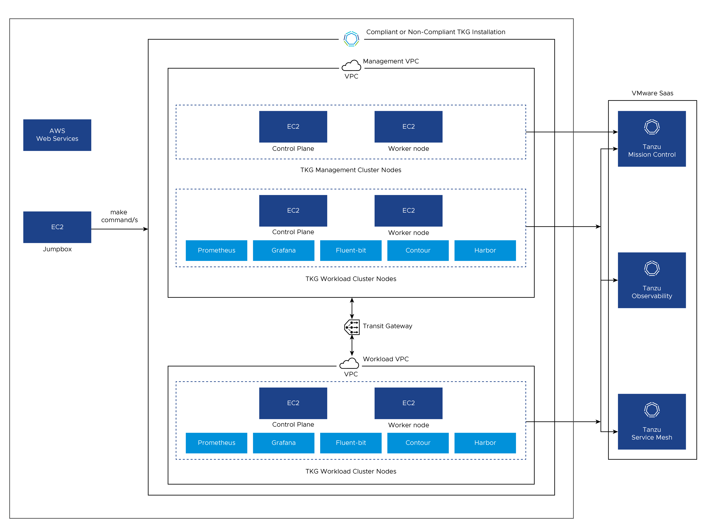
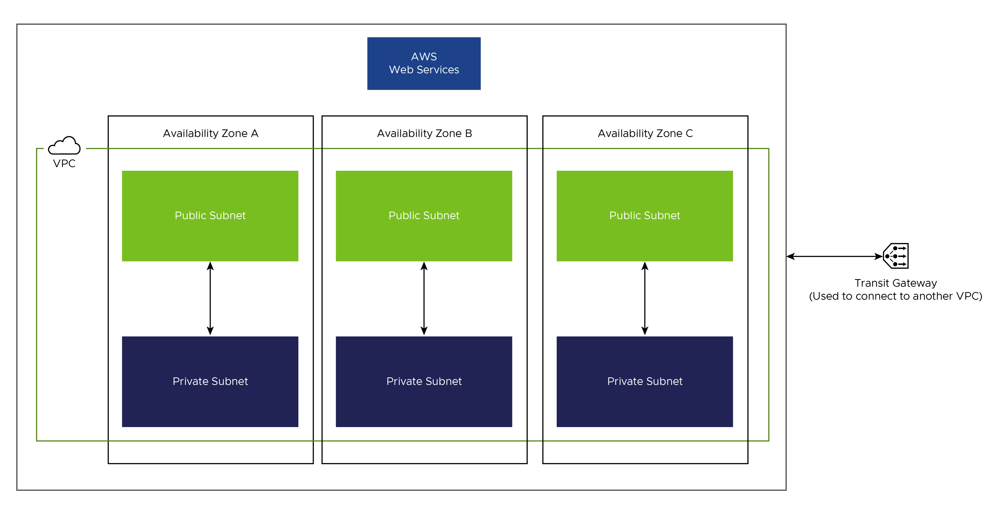

# Deploying Tanzu for Kubernetes Operations on Non Air-gapped AWS VPC Using Service Installer for VMware Tanzu

Service Installer for VMware Tanzu (SIVT) enables you to install Tanzu for Kubernetes Operations on an AWS VPC with the help of easily transportable binaries and TAR files and Terraform automation scripts.

You can deploy the following configurations:

 - STIG hardened and FIPS compliant platform
 - Non-compliant platform that makes use of vanilla Tanzu Kubernetes Grid images for deployment

Service Installer for VMware Tanzu deploys the following components:

- AWS components:
  - Management VPC
  - Workload VPC
  - 3 private and 3 public subnets
  - Transit gateway and associated networking
  - CloudFormation stack configuration

- Tanzu components:
  - Tanzu Kubernetes Grid management cluster
  - Tanzu Kubernetes Grid workload cluster
  - User managed packages: Harbor, Prometheus, Grafana, Fluent Bit, and Pinniped with OIDC and LDAP identity management
  - Integration of management and workload cluster with SaaS offerings such as Tanzu Mission Control (TMC), Tanzu Service Mesh (TSM), and Tanzu Observability (TO)

This document provides the steps to deploy Tanzu Kubernetes Grid on AWS environment using Service Installer for VMware Tanzu.

## Prerequisites

Before deploying Tanzu Kubernetes Grid on AWS using Service Installer for VMware Tanzu (SIVT), ensure that the following are set up.

- An RSA SSH key pair created in the AWS region where Tanzu Kubernetes Grid needs to be deployed.

- An S3 bucket with all of the Tanzu Kubernetes Grid dependencies required for the installation.

- The required binaries are uploaded to the S3 bucket.
  
  1. Download the TAR file `service-installer-for-AWS-Tanzu-1.3.tar.gz` from the [VMware Marketplace](https://marketplace.cloud.vmware.com/services/details/service-installer-for-vmware-tanzu-1?slug=true). This TAR file contains automation scripts and deployment dependencies - _To deploy Tanzu Kubernetes Grid using automation_

  1. Copy the TAR file to the Jumpbox VM.
    
  1. Extract the TAR file using the following command.
       ```sh
      cd ~/sivt_bits/                                      -> Change directory to the location of the TAR file. In this example, ~/sivt_bits/
        tar -xvf service-installer-for-AWS-Tanzu-1.3.tar.gz      -> Extract TAR file contents to the `~/sivt_bits/deployment_binaries/` directory
      ```

  1. Change the directory to the Service Installer for VMware Tanzu codebase directory which is under the `deployment_binaries` folder and set the following variables.
      ```sh
      cd ~/sivt_bits/deployment_binaries/sivt-aws-federal/
      export BUCKET_NAME=MY-BUCKET
      export DEPS_DIR=MY-DEPENDENCY-DIRECTORY     -> This should point to the directory `~/sivt_bits/deployment_binaries`
      ```
    
  1. Run the following command to upload the binaries to the S3 bucket.
    
      **Note:** Before running this command, make sure that the present working directory is `~/sivt_bits/deployment_binaries/sivt-aws-federal/`
      ```sh
      make upload-deps
      ```

- A Jumpbox VM that has the following components:
  - Docker
  - yq
  - awscli
  - jq
  - make (build-essentials)
  - terraform
  - git

  The following binaries are available as part of the TAR file and they get uploaded to S3 bucket in a prerequisite step. You do not need to install these binaries manually.
  - kind
  - goss
  - CAPI Image builder
  - docker-compose
  - crashd

- Account used for deployment must have access to create CloudFormation along with policies, roles, or node profiles, security groups, EC2 instances, S3 bucket policies, and AMIs as well as create, get, and list access to the Tanzu Kubernetes Grid dependencies bucket (S3 bucket) mentioned previously.

- Bash shell support must be enabled as the shell scripts in the code use `/bin/bash`.

- By default, AWS allows only 5 VPCs per region. Hence, make sure AWS region that you are using has provision to create two VPCs.

- By default, AWS allows only 5 Elastic IP addresses per region. Hence, make sure AWS region that you are using has at least 2 free Elastic IP addresses.

### Prerequisites for Using Existing VPCs

These prerequisites are applicable only if you use manually pre-created VPC for the deployment. Make sure that the following steps are completed before running `make` commands to initiate the deployment.

1. Create a file named `terraform.tfvars` in the `~/deployment_binaries/sivt-aws-federal/terraform/` directory and add the following information in the file.
   ```
    az_zone = <Availability Zone-1>
    az_zone_1 = <Availability Zone-2>
    az_zone_2 = <Availability Zone-3>
    management_private_subnet_id_1 = <ID of private subnet-1 created for management VPC>
    management_private_subnet_id_2 = <ID of private subnet-2 created for management VPC>
    management_private_subnet_id_3 = <ID of private subnet-3 created for management VPC>
    management_public_subnet_id_1 =  <ID of public subnet-1 created for management VPC>
    management_public_subnet_id_2 = <ID of public subnet-2 created for management VPC>
    management_public_subnet_id_3 = <ID of public subnet-3 created for management VPC>
    management_vpc_id = <Management VPC ID>
    workload_private_subnet_id_1 = <ID of private subnet-1 created for workload VPC>
    workload_private_subnet_id_2 = <ID of private subnet-2 created for workload VPC>
    workload_private_subnet_id_3 = <ID of private subnet-3 created for workload VPC>
    workload_public_subnet_id_1 = <ID of public subnet-1 created for workload VPC>
    workload_public_subnet_id_2 = <ID of public subnet-2 created for workload VPC>
    workload_public_subnet_id_3 = <ID of public subnet-3 created for workload VPC>
    workload_vpc_id = <Workload VPC ID>
   ```
   **Example:**
 
    ```sh
    cat ~/sivt-aws-federal/terraform/terraform.tfvars

    az_zone = "eu-west-1a"
    az_zone_1 = "eu-west-1b"
    az_zone_2 = "eu-west-1c"
    management_private_subnet_id_1 = "subnet-xxxxxxxxx693"
    management_private_subnet_id_2 = "subnet-xxxxxxxxx64ab"
    management_private_subnet_id_3 = "subnet-xxxxxxxxx636"
    management_public_subnet_id_1 = "subnet-xxxxxxxxx119"
    management_public_subnet_id_2 = "subnet-xxxxxxxxx089d"
    management_public_subnet_id_3 = "subnet-xxxxxxxxx485"
    management_vpc_id = "vpc-xxxxxxxxxbf6"
    workload_private_subnet_id_1 = "subnet-xxxxxxxxx188"
    workload_private_subnet_id_2 = "subnet-xxxxxxxxx7e8"
    workload_private_subnet_id_3 = "subnet-xxxxxxxxx9be"
    workload_public_subnet_id_1 = "subnet-xxxxxxxxx037"
    workload_public_subnet_id_2 = "subnet-xxxxxxxxxd1c"
    workload_public_subnet_id_3 = "subnet-xxxxxxxxxa62"
    workload_vpc_id = "vpc-xxxxxxxxxcb9"
    ```

1. Save the file and continue with the deployment.

## Deployment Steps

**Note**: If you have completed all the steps in [Prerequisites](#prerequisites), skip to Step 3 as Step 1 and Step 2 of this section are covered in [Prerequisites](#prerequisites).

1. Copy the TAR file to the Jumpbox VM.

1. Copy the dependencies to the AWS S3 bucket by executing following commands inside the Federal SIVT AWS git repository.
    ```sh
    export BUCKET_NAME=<S3 Bucket>
    export DEPS_DIR=<Directory where dependencies are located> -> Should be set to `<your_directory>/deployment_binaries/`                    ->
    
    make upload-deps
    ```

1. Export the following environment variables.
    ```sh
    export BUCKET_NAME=<AWS S3 bucket name containing dependencies>
    export SSH_KEY_NAME=<AWS RSA SSH key>
    export AWS_AZ_ZONE=<AWS AZ_ZONE>
    export AWS_ACCESS_KEY_ID=<AWS Access Key ID>
    export AWS_SECRET_ACCESS_KEY=<AWS Secret Access Key>
    export AWS_DEFAULT_REGION=<AWS Region where Tanzu Kubernetes Grid will be installed>
    export TKR_VERSION=<Tanzu Kubernetes Release Version>
    export TKG_VERSION=<Tanzu Kubernetes Grid Version>
    ```

    **Note:** If you are using cloudGate or any other third party gateway to access AWS, export `AWS_SESSION_TOKEN`. This is not needed if you are accessing AWS directly.
    ```sh
    export AWS_SESSION_TOKEN=<AWS session token>
    ```
1. Specify the deployment type. 
   
   **Compliant deployment:** By default, Service Installer for VMware Tanzu deploys FIPS compliant Tanzu Kubernetes Grid master and worker nodes. In this type of deployment, Service Installer for VMware Tanzu makes use of FIPS compliant and STIG hardened Ubuntu (18.04) base OS for Tanzu Kubernetes Grid cluster nodes, FIPS enabled Kubernetes overlay, and FIPS compliant Tanzu Kubernetes Grid images. To perform compliant deployment, perform following steps
    - For doing FIPS compliance deployment on ubuntu, automation needs ubuntu advantage username and password. Export these using following commands
      ```
      export UBUNTU_ADVANTAGE_PASSWORD=<user:password>
      export UBUNTU_ADVANTAGE_PASSWORD_UPDATES=<user:password>
      ```


    - If ubuntu advantage username and password are not available, then disable FIPS enablement for ubuntu by setting `install_fips` variable to `no` in file `<your_directory>/deployment_binaries/sivt-aws-federal/ami/stig/roles/canonical-ubuntu-18.04-lts-stig-hardening/vars/main.yml`. This will disable FIPS at OS level.

   **Non-compliant deployment:** If you are looking for deployment with vanilla Tanzu Kubernetes Grid master and worker nodes, set the `COMPLIANT_DEPLOYMENT` variable to `false` by running the following command on your Jumpbox VM. Once this variable is set, Service Installer for VMware Tanzu makes use of vanilla Tanzu Kubernetes Grid images for installation.

      ```sh
      export COMPLIANT_DEPLOYMENT=false
      ```

   The script sets these values for Harbor, Prometheus, and Grafana extensions.
    ```sh
    HARBOR_HOSTNAME="harbor.system.tanzu"
    PROMETHEUS_HOSTNAME="prometheus.system.tanzu"
    GRAFANA_HOSTNAME="grafana.system.tanzu"
    HARBOR_PASSWORD="harbor123"
    ```
  
1. Use the following commands if you want to overwrite these values.
    ```sh
    export TF_VAR_harbor_host_name=<Hostname for Harbor>
    export TF_VAR_prometheus_host_name=<Hostname for Prometheus>
    export TF_VAR_grafana_host_name=<Hostname for Grafana>
    export TF_VAR_harbor_extension_password=<Password for Harbor>
    ```

1. Install Tanzu Kubernetes Grid extensions.
    
    By default, the script installs cert_manager and Contour as part of the default installation. For installing other extensions, set the following variables to `true`.

    ```sh
    export HARBOR_DEPLOYMENT=true
    export PROMETHEUS_DEPLOYMENT=true
    export GRAFANA_DEPLOYMENT=true
    export FLUENT_BIT_DEPLOYMENT=true
    ```
    
    The installer resolves the prerequisites for extension deployments. For example: Grafana needs cert-manager, Contour, and Prometheus. The scripts install cert-manager, Contour, and Prometheus before Grafana installation if `GRAFANA_DEPLOYMENT` is set to `true`.

    **Known Issues with Extensions:**
    - Prometheus deployment fails if SaaS is enabled.
    - Harbor deployment fails both with and without SaaS in multi workload cluster configurations.

1. Enable Pinniped on management and workload clusters.
    
    By default, Pinniped is set to false. For enabling Pinniped on management and workload clusters, set the following variables:

      ```sh
      export ENABLE_IDENTITY_MANAGEMENT=true
      export IDENTITY_MANAGEMENT_TYPE=<ldap or oidc>
      ```

    **LDAP Identity Management:**

      ```sh 
      export LDAP_HOST= <The IP or DNS address of your LDAP server>
      export LDAP_USER_SEARCH_BASE_DN=<The point from which to start the LDAP search>
      export LDAP_GROUP_SEARCH_BASE_DN=<The point from which to start the LDAP search>
      ```

    **OIDC Identity Management:**
      ```sh
      export OIDC_IDENTITY_PROVIDER_CLIENT_ID=<The client_id value that you obtain from your OIDC provider>
      export OIDC_IDENTITY_PROVIDER_CLIENT_SECRET=<The Base64 secret value that you obtain from your OIDC provider>
      export OIDC_IDENTITY_PROVIDER_GROUPS_CLAIM=<The name of your groups claim. This is used to set a user’s group in the JSON Web Token (JWT) claim>
      export OIDC_IDENTITY_PROVIDER_ISSUER_URL=<The IP or DNS address of your OIDC server>
      export OIDC_IDENTITY_PROVIDER_SCOPES=<A comma separated list of additional scopes to request in the token response>
      export OIDC_IDENTITY_PROVIDER_USERNAME_CLAIM=<The name of your username claim>
      ```

    For more information on these variables, see [Tanzu CLI Configuration File Variable Reference](https://docs.vmware.com/en/VMware-Tanzu-Kubernetes-Grid/1.5/vmware-tanzu-kubernetes-grid-15/GUID-tanzu-config-reference.html).

1. Configure integration with SaaS offerings.
    - To register master and workload cluster to Tanzu Mission Control (TMC), provide TMC refresh token by running the following command.
      ```sh
      export TMC_API_TOKEN=<TMC API token>
      ```
    - To register workload cluster to Tanzu Observability (TO), run the following commands. If these variables are not set, the installer skips Tanzu Observability integration.
      ```sh
      export TO_TOKEN=<token for TO>
      export TO_URL=<TO URL>
      ```

      Alternatively, you can also run the following command to skip Tanzu Observability integration.
      ```sh
      export SKIP_TO=true
      ```

    - If Tanzu Mission Control refresh token is provided, the installer enables Tanzu Service Mesh (TSM) integration by default. If you plan to skip Tanzu Service Mesh integration for workload cluster, run the following command.
      ```sh
      export SKIP_TSM=true
      ```
      **Note:** Tanzu Service Mesh integration requires worker node to have atleast 4 CPUs. If you specify `SKIP_TSM=false`, the installer deploys worker node with instance type `m5.xlarge`.

1. Install Tanzu Kubernetes Grid.
    
    **Note:** 
    1. Once you extract the TAR file downloaded as part of [Prerequisites](#prerequisites), make sure that you are in `<your_directory>/deployment_binaries/sivt-aws-federal/` folder while running `make` commands.
      
      1. To enable or disable STIG and FIPS compliance, see step 4 of this deployment procedure.
    
    To get the list of all the make command targets run the following command.
    ```sh
    make
    ```

    For installing Tanzu Kubernetes Grid, run the following set of commands based on your use case.
    
    - **Use case 1:** End-to-End deployment using Ubuntu OS with VPCs creation.
  
       For details on the different networking components created by the installer, see the [VPC Creation](#vpc-creation) section.
        
        To install Tanzu Kubernetes Grid on native AWS non-airgapped environment with Ubuntu OS, run the following command.

      ```sh 
      make non-airgapped-deployment-with-vpc
      ```
  
    - **Use case 2:** End-to-End deployment using Ubuntu OS without VPCs creation.
      
      In this case, the installer uses the existing (manually pre-created) VPCs. Before running the `make` command, complete the steps mentioned in the [Prerequisites for Using Existing VPCs](#prerequisites-for-using-existing-vpcs) section.
        
        To install Tanzu Kubernetes Grid on native AWS non-airgapped environment with Ubuntu OS.

      ```sh 
      make non-airgapped-deployment-without-vpc
      ```

    - **Use case 3:** Modular step-by-step deployment using `Ubuntu` OS with VPCs creation.
        
        If a few of the steps in the deployment need manual intervention such as creation of roles, policies, or profiles and Harbor installation, then run the following commands in the given order. Skip the step which is performed manually. For detailed information on `create-non-airgapped-multi-vpc-infra` target, see the [VPC Creation](#vpc-creation) section.

      **Note:** The detailed description of individual steps is given in the [Make Targets](#make-targets) section.
      
      ```sh
      make verify-non-airgap-inputs
      make create-non-airgapped-multi-vpc-infra
      make fetch-aws-infra-id
      make cf
      make build-ubuntu-bootstrap-ami-online
      make build-ubuntu-node-ami-online
      make install-ubuntu-non-airgap 
      ```
    
    - **Use case 4:** Modular step-by-step deployment using `Ubuntu` OS without VPC
        
        In this case, the installer uses the existing (manually pre-created) VPCs. Before running the `make` command, complete the steps mentioned in the [Prerequisites for Using Existing VPCs](#prerequisites-for-using-existing-vpcs) section.

        If a few of the steps in the deployment need manual intervention such as creation of roles, policies, or profiles and Harbor installation, then run the following commands in the given order. Skip the step which is performed manually.
        
      **Note:** The detailed description of individual steps is given in the [Make Targets](#make-targets) section.

      ```sh
      make verify-non-airgap-inputs
      make cf 
      make build-ubuntu-bootstrap-ami-online
      make build-ubuntu-node-ami-online
      make install-ubuntu-non-airgap
      ```

## Make Targets

**Note:** Prerequisites mentioned in this table are applicable only if you are not using `make all` or if you are not following the step by step process.

  |CLI Parameter| Description|Prerequisites|
  |--------|--------|--------|
  |non-airgapped-deployment-without-vpc|End-to-end deployment using Ubuntu without creating VPCs. Installer uses existing VPC provided by user|NA|
  |non-airgapped-deployment-with-vpc|End-to-end deployment using Ubuntu. Installer creates 2 VPCs and uses them for deployment|NA|
  |verify-non-airgap-inputs|Checks all the inputs mentioned in [Deployment Steps](#deployment-steps) are set. Installer checks for mandatory variables|NA|
  |create-non-airgapped-multi-vpc-infra|Creates 2 VPCs, one for management cluster and one for workload cluster|Make sure the AWS region you are using has provision to create 2 VPCs|
  |fetch-aws-infra-id|Fetches VPC IDs for the VPCs being created using `create-non-airgapped-multi-vpc-infra` target| Make sure `create-non-airgapped-multi-vpc-infra` is performed|
  |cf|Make Cloud Formation if it doesn't exist along with roles, policies or profiles. Refer [AWS IAM components created by cf](#aws-iam-components-created-by-cf) section for more details|NA|
  |build-ubuntu-bootstrap-ami-online|Build Ubuntu based bootstrap AMI| Make sure `cf` is performed|
  |build-ubuntu-node-ami-online|Build Ubuntu based STIG compliant node AMI|Make sure `cf` is performed|
  |install-ubuntu-non-airgap|Deploy bootstrap on EC2 instance and deploy management and workload clusters on top of Ubuntu based node AMI|  Make sure: </br>1. VPCs are created.<br/>2. `cf` is performed<br/>3. Bootstrap AMI and node AMIs are created |

  The entire setup that is brought up by the installer:

  

### VPC Creation

If you opt for VPC creation with Service Installer for VMware Tanzu using either `non-airgapped-deployment-with-vpc` or `create-non-airgapped-multi-vpc-infra` make target, the installer creates the following networking components:

- 2 VPCs; one for the management cluster and one for the workload cluster.
- A transit gateway to enable communication between these 2 VPCs
- 3 private subnets for each VPC. Furthermore, these 3 subnets are created across three Availability Zones (AZ) of the give region. For example, if the user provides region as `us-west-2` then the installer creates 3 subnets across `us-west-2a`, `us-west-2b`, and `us-west-2c`
- 3 public subnets for each VPC. Furthermore, these 3 subnets are created across three Availability Zones(AZ) of the give region. For example, if the user provides region as `us-west-2` then the installer creates 3 subnets across `us-west-2a`, `us-west-2b`, and `us-west-2c`

The following diagram depicts single VPC and associated networking created by the installer:
 


### AWS IAM Components Created by cf

The `make cf` command creates the following instance profiles, roles, and policies. If you are manually creating instance profiles, roles, and policies, ensure that the following are created and they are given the same names as in this table.

**Note:** For more information on role and their detailed actions, see the [cloud-formation-iamtemplate](https://gitlab.eng.vmware.com/core-build/sivt-aws-federal/-/blob/main/cloud-formation-iamtemplate) file

|Profile|Roles|Policies|
|-------|-----|--------|
|control-plane.tkg.cloud.vmware.com|control-plane.tkg.cloud.vmware.com|control-plane.tkg.cloud.vmware.com <br/>controllers.tkg.cloud.vmware.com<br/>nodes.tkg.cloud.vmware.com|
|controllers.tkg.cloud.vmware.com|controllers.tkg.cloud.vmware.com|controllers.tkg.cloud.vmware.com|
|nodes.tkg.cloud.vmware.com|nodes.tkg.cloud.vmware.com|nodes.tkg.cloud.vmware.com|
|tkg-s3-viewer|tkg-s3-role|tkg-airgapped-bucket|
|tkg-bootstrap|tkg-bootstrap|tkg-airgapped-bucket<br/>nodes.tkg.cloud.vmware.com<br/>controllers.tkg.cloud.vmware.com<br/>control-plane.tkg.cloud.vmware.com|

## Customizing Tanzu Kubernetes Grid

All configurable options and their default values can be seen in the
[terraform/startup.sh](https://gitlab.eng.vmware.com/core-build/sivt-aws-federal/-/tree/main/terraform) file. The variables must be edited in this file for them to take effect because Terraform is not configured to take all of them as input.

For a description of all variables, see the [Variables](#variables) section.


## Accessing Your Tanzu Kubernetes Grid Cluster

  - You can run the following command on the bootstrap instance to track the progress of the Tanzu Kubernetes Grid installation. 
      ```
      sudo tail -f /var/log/cloud-init-output.log
      ```
  - Once you see a message about the security group of your bootstrap being modified, it implies that the script has finished executing. You can now run `kubectl get pods -A` to see all the pods running on your management cluster. Additionally, if you run `kubectl get nodes`, you can use an IP address of one of the cluster nodes and SSH to it from the bootstrap node using the SSH key that you provided to Terraform.


## Clean Up the Deployment

  - To delete the Tanzu Kubernetes Grid cluster, run the following command on the bootstrap node.

    ```sh
    sudo su
    cd non-airgapped
    ./delete-non-airgapped.sh
    ```

  - To delete the Tanzu Kubernetes Grid bootstrap node, run the following command.
  
    Before deleting the bootstrap node, make sure that the Tanzu Kubernetes Grid management cluster's `kubeconfig` is saved and then delete it using the commands in the preceding step.
    ```sh
    make destroy
    ```

  - To delete VPCs created by the installer, run the following command.

    ```sh
    make destroy-multi-vpc-infra
    ```
  
  - To delete both Tanzu Kubernetes Grid bootstrap and VPCs, run the following command.

    ```sh
    make destroy-non-airgapped
    ```

  **Note:** AMIs and load balancers created as part of the deployment must be deleted manually.

## Variables

The `terraform/startup.sh` file contains the following configurable options that you can set within the file.

|Name|Default|Description
|---|---|---|
|AMI_ID|tkg_ami_id variable from Terraform|The AMI ID to deploy |
|AWS_NODE_AZ|Pulls in az_zone from Terraform|The first AWS availability zone where TKG will be deployed|
|MANAGEMENT_CLUSTER_NAME|tkg-mgmnt|The name of the TKG management cluster to deploy|
|WORKLOAD_CLUSTER_NAME|tkg-workload| The name of the TKG workload cluster to deploy|
|WORKLOAD_CLUSTER_NAME_2|tkg-workload-2|The name of the second TKG workload cluster to deploy|
|AWS_SSH_KEY_NAME|Pulls from tfvars| The SSH key to use for TKG cluster; must be RSA for STIG|
|AWS_REGION|Pulls from tfvars| The AWS region to deploy Tanzu Kubernetes Grid|
|CLUSTER_PLAN|dev|The cluster plan for Tanzu Kubernetes Grid|
|ENABLE_AUDIT_LOGGING|true|Enable to disable auditing on Kubernetes|
|TKG_CUSTOM_COMPATABILITY_PATH|fips/tkg-compatability|The compatibility path to use; set to "" for non FIPS deployment|
|COMPLIANT_DEPLOYMENT|true|Set to false for non-compliant deployment|
|ENABLE_SERVING_CERTS|false|Enable or disable serving certificates on Kubernetes|
|PROTECT_KERNEL_DEFAULTS|true|Enable to disable `--protect-kernel-defaults` on kubelet. Set to `true` only for AMIs that allow it|
|AWS_NODE_AZ_1|unset|Required for Prod clusters, set node availability zone 1|
|AWS_NODE_AZ_2|unset|Required for Prod clusters, set node availability zone 2|
|AWS_PRIVATE_SUBNET_ID_1|unset|Required for Prod clusters private subnet 1|
|AWS_PRIVATE_SUBNET_ID_2|unset|Required for Prod clusters private subnet 2|
|CONTROL_PLANE_MACHINE_TYPE|unset|Required for Prod clusters. The AWS machine type for control plane nodes in Kubernetes|
|NODE_MACHINE_TYPE|unset|Required For Prod clusters. The AWS machine type to use for worker nodes in Kubernetes|
|SERVICE_CIDR|unset|Required For Prod clusters, set Kubernetes services CIDR|
|CLUSTER_CIDR|unset|Required For Prod clusters, set cluster CIDR|
|HARBOR_HOSTNAME|harbor.system.tanzu|Hostname for Harbor extension|
|PROMETHEUS_HOSTNAME|prometheus.system.tanzu|Hostname for Prometheus extension|
|GRAFANA_HOSTNAME|grafana.system.tanzu| Hostname for Grafana extension|
|HARBOR_PASSWORD|harbor123| Password for Harbor extension|
|ENABLE_IDENTITY_MANAGEMENT|false|Set to `true` for enabling Pinniped|
|IDENTITY_MANAGEMENT_TYPE|unset| Set to `ldap` or  `oidc`|
|LDAP_HOST|unset|The IP or DNS address of your LDAP server. If the LDAP server is listening on the default port 636, which is the secured configuration, you do not need to specify the port. If the LDAP server is listening on a different port, provide the address and port of the LDAP server in the form `host:port`|
|LDAP_USER_SEARCH_BASE_DN|unset|The point from which to start the LDAP search. For example, `"OU=Users,OU=domain,DC=io"`|
|LDAP_GROUP_SEARCH_BASE_DN|unset|The point from which to start the LDAP search. For example, `"OU=Groups,OU=domain,DC=io"`|
|OIDC_IDENTITY_PROVIDER_CLIENT_ID|unset|The client_id value that you obtain from your OIDC provider. For example, if your provider is Okta, log in to Okta, create a Web application, and select the Client Credentials options to get a client_id and secret|
|OIDC_IDENTITY_PROVIDER_CLIENT_SECRET|unset|The Base64 secret value that you obtain from your OIDC provider.|
|OIDC_IDENTITY_PROVIDER_GROUPS_CLAIM|unset|The name of your group's claim. This is used to set a user’s group in the JSON Web Token (JWT) claim. The default value is groups|
|OIDC_IDENTITY_PROVIDER_ISSUER_URL|unset|The IP or DNS address of your OIDC server|
|OIDC_IDENTITY_PROVIDER_SCOPES|unset|A comma separated list of additional scopes to request in the token response. For example, `"email,offline_access"`|
|OIDC_IDENTITY_PROVIDER_USERNAME_CLAIM|unset|The name of your username claim. This is used to set a user’s username in the JWT claim. Depending on your provider, enter claims such as user_name, email, or code|
|TMC_API_TOKEN|unset| To enable Tanzu Mission Control (TMC) and to register management and workload clusters to TMC, provide TMC refresh token|
|TO_TOKEN|unset|To enable Tanzu Observability(TO) for workload cluster provide the TO token|
|TO_URL|unset|To enable Tanzu Observability(TO) for workload cluster provide the TO URL|

## Troubleshooting Tips

- If your cluster does not come up, try the following steps.

  - Export your KUBECONFIG to the one provided for your bootstrap kind cluster when Tanzu Kubernetes Grid starts.
    ```sh
    export KUBECONFIG=~/.kube-tkg/tmp/config_<UID>
    ```

  - Use the following commands for debugging.
    ```
    kubectl get events -A --sort-by='.metadata.creationTimestamp'
    kubectl get clusters -n tkg-system -o yaml
    kubectl get machinedeployments -n tkg-system -o yaml
    kubectl get awsclusters -n tkg-system -o yaml
    kubectl get kcp -n tkg-system -o yaml
    kubectl get machines -n tkg-system -o yaml
    ```

    If you are sure about a change that you need to make to one of these `.yaml` object specifications, try running `kubectl edit <apiobject> -n tkg-system <object name>` to edit the file. This command opens up a vi session and allows you to edit the file. If you edit an object, ensure that if there is an `OwnerReferences` section in the yaml file, it must not have a controller that will revert your changes.

- The following error occurs while running `make` commands if Docker is not running in Jumpbox VM:
    ```
    Cannot connect to the Docker daemon at unix:///var/run/docker.sock. Is the docker daemon running?
    make[1]: *** [fetch-s3-and-build] Error 1
    make[1]: Leaving directory `/home/ec2-user/sivt/deployment_binaries/sivt-aws-federal/ami/tkg-bootstrap'
    make: *** [build-ubuntu-bootstrap-ami-online] Error 2
    ```

   To restart Docker, run the `systemctl restart docker` command and make sure that Docker is in the `running` state before starting the deployment.

- The following error occurs if the AWS region you are using does not have a minimum of 2 Elastic IP addresses free:
    ```
    Error: Error creating EIP: AddressLimitExceeded: The maximum number of addresses has been reached.
    status code: 400
    ```

   To resolve this error, make sure that 2 Elastic IP addresses are free in the region in which you are performing the deployment.
