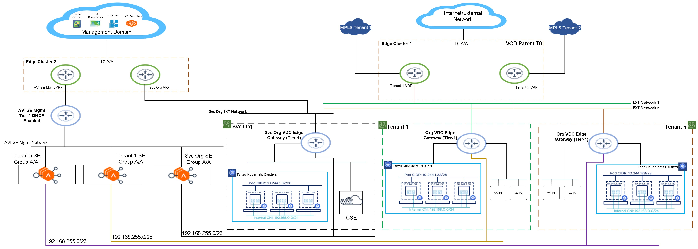

# Deploying VMware Tanzu for Kubernetes Operations on VMware Cloud Director Using Service Installer for VMware Tanzu

This document provides the steps for deploying VMware Tanzu for Kubernetes Operations on VMware Cloud Director (VCD) using Service Installer for VMware Tanzu (SIVT) with Container Service Extension (CSE) plugin.

The environment must be in the following state before initiating the deployment using SIVT.

- VMware SDDC is deployed and configured as per VMware best practices
- NSX-T is deployed and integrated with the SDDC infrastructure
- VMware Cloud Director is deployed and configured with the infra resources (vCenter, NSX-T) and cloud resources (T0 gateways, external network, networks pools, and PVDC)
To summarize, a fully functional VMware Cloud Director environment is required which can onboard tenants and serve required functionality such as creating Org-VDC, tier-1 edge gateways, and routed network.

## Supported Component Matrix

The following table provides the component versions.

| **Component**                   | **Version**        |
|---|---|
| VMware Cloud Director       | 10.4 and later |
| Container Service Extension | 4.0            |
| NSX-T                       | 3.1.3          |
| AVI                         | 21.1.4         |

## Firewall Requirements

| **Source**                              | **Destination**                                                                   | **Port**             | **Description**                                                                                                                                                      |   |
|---|---|---|---|---|
| CSE Server                          | VCD                                                               | TCP: 443         | VCD Public API Address                                                                                                                               |   |
| CSE Server                          | DNS                                                                           | UDP:53           | Core Service: Allow components to look up machine addresses                                                                                                      |   |
| Tenant Org Network*                 | Internet                                                                      | TCP:443 TCP:6443 | Download Tanzu binaries from VMware Public Image Repository                                                                                                      |   |
| Tenant Org Network*                 | VCD                                                               | TCP:443          | CSI/CCM (CPI) to communicate with VCD to create required objects in VCD (Load balancer, PVs, etc.) CCM: Cloud Controller Manager CSI: Container Storage Interface |   |
| Tenant Org Network*                 | DNS                                                                           | UDP:53           | Core Service: Allow components to look up machine addresses                                                                                                      |   |
| Tenant Org Network*                 | NTP                                                                           | UDP:123          | Core Service: Allow components to sync the current time                                                                                                          |   |
| NSX ALB Controllers and Cluster VIP | vCenter                                                                       | TCP:443          | Allow AVI to discover vCenter objects and deploy SEs as required                                                                                                 |   |
| NSX ALB Controllers                 | ESXi Hosts                                                                    | TCP:443          | Management access for Service Engine Creation                                                                                                                    |   |
| NSX ALB Controllers and Cluster VIP | NSX-T Manager (Workload Domain)                                               | TCP:443          | NSX-T Cloud Integration and discover NSX-T objects                                                                                                               |   |
| NSX ALB Controllers                 | DNS                                                                           | UDP:53           | Core Service: Allow components to look up machine addresses                                                                                                      |   |
| NSX ALB Controllers                 | NTP                                                                           | UDP:123          | Core Service: Allow components to sync the current time                                                                                                          |   |
| NSX ALB Service Engine Mgmt Network | AVI Controllers                                                               | TCP:8443         | Secure channel for key exchange                                                                                                                                  |   |
| NSX ALB Service Engine Mgmt Network | AVI Controllers                                                               | TCP:22           | Secure channel for communication between NSX ALB components for configuration sync, metrics and logs transfer, heartbeats, and other management processes        |   |
| AVI Service Engine Mgmt Network     | AVI Controllers                                                               | UDP:123          | Core Service: Allow components to sync the current time                                                                                                          |   |
| SIVT OVA                            | VCD Management vCenter Workload vCenter NSX-T NSX ALB Controllers | TCP:443          | Configure all required components as per the Architecture                                                                                                        |   |
| SIVT OVA                            | DNS NTP                                                                       | UDP:53 UDP:123   | Core Service: Allow components to look up machine addresses Core Service: Allow components to sync the current time                                              |   |

## Tanzu for Kubernetes Operations on VMware Cloud Director with Container Service Extension Reference Architecture

The following diagram represents the reference architecture required for deploying Tanzu for Kubernetes Operations on VMware Cloud Director using Service Installer for VMware Tanzu.



## Service Installer for VMware Tanzu Capabilities

Service Installer for VMware Tanzu enables Tanzu for Kubernetes Operations on VMware Cloud Director based on the network design shown above. The following are the high-level functions that are performed by Service Installer for VMware Tanzu.

**Note:** Service Installer for VMware Tanzu also supports POC environments where management and user workload domains run together on a shared management domain (a single vCenter architecture model).

- Deploy and Configure NSX Advanced Load Balancer or leverage existing NSX Advanced Load Balancer in the environment.
- Create NSX-T cloud, or leverage existing NSX Advanced Load Balancer
- Create a new service organization or make use of an existing Organization in VMware Cloud Director (VCD)
- Create two (2) catalogs:
  - Download CSE OVA from VMware Marketplace and upload it to Catalog 1
  - Download Kubernetes images from VMware Marketplace and upload them to Catalog 2. Catalog 2 is shared with all organizations.
- Service Organization Virtual Datacenter (VDC)
  - Create service organization VDC
  - Create tier-1 gateway
  - Create routed network
  - Create required gateway firewalls
  - Create SNAT rules
  - Create a service engine group and import it to cloud, or make use of an existing service engine group
  - Enable load balancing capabilities on service organization VDC
- CSE Capabilities
  - Import and publish CSE 4.0 CSE Plugin
  - Perform initial configuration for CSE server with the CSE plugin, which involves:
    - CSE admin role
    - Create and publish 'Kubernetes Clusters Rights Bundle'
    - Create and publish 'Kubernetes Cluster Author' global role
    - Create VM sizing policies
  - Deploy and configure CSE server in service organization VDC

## SIVT VCD Deployment Supported Use-cases


| Use-Cases      	| Description                                                                                                                                                                                                                                                                                                                                                                                                                                                                                                                                                                                                                                                                                                                                                                                                                                                                                                                                                                                                                                                                                                                                                                                                                                                            	|
|----------------	|------------------------------------------------------------------------------------------------------------------------------------------------------------------------------------------------------------------------------------------------------------------------------------------------------------------------------------------------------------------------------------------------------------------------------------------------------------------------------------------------------------------------------------------------------------------------------------------------------------------------------------------------------------------------------------------------------------------------------------------------------------------------------------------------------------------------------------------------------------------------------------------------------------------------------------------------------------------------------------------------------------------------------------------------------------------------------------------------------------------------------------------------------------------------------------------------------------------------------------------------------------------------	|
| **Greenfield** 	| User triggers SIVT Automation which performs the below mentioned operations:-<br>  a.) Deploys NSX ALB, configures NSX-T CLoud, configures Service Engine Group<br>  b.) Imports above mentioned components into VCD  <br>  c.) Creates service Org/Org VCD and tier-1 gateway<br>  d.) Creates routed network, NAT and firewall rules <br>  e.) Creates catalogs and SE group<br>  f.) Imports SE group and enables load balancing on the tier-1 gateways<br>  g.) Imports CSE and K8s OVAs <br>  h.) Deploys and enables CSE Plugin<br>  i.) Creates required roles, user, and API token<br>  j.) Deploys CSE Server                                                                                                                                                                                                                                                                                                                                                                                                                                                                                                                                                                                                                                                   	|
| **Brownfield** 	| _**Scenario 1:-**_ NSX ALB, NSX-T Cloud and Service Engine Group are created. User triggers SIVT Automation which performs the below mentioned operations:-<br>    a.) Imports above mentioned components into VCD<br>    b.) Creates service Org/Org VCD and tier-1 gateway<br>    c.) Creates routed network, NAT and firewall rules <br>    d.) Creates catalogs and SE group<br>    e.) Imports SE group and enables load balancing on the tier-1 gateways<br>    g.) Imports CSE and K8s OVAs <br>    h.) Deploys and enables CSE Plugin<br>    i.) Creates required roles, user, and API token<br>    j.) Deploys CSE server<br><br>_**Scenario 2:-**_ NSX ALB, NSX-T Cloud and Service Engine Group are manually created and also manually imported into VCD. User triggers SIVT Automation which performs the below mentioned operations:-<br>     a.) Creates service Org/Org VCD and tier-1 gateway<br>     b.) Creates routed network, NAT and firewall rules <br>     c.) Creates catalogs and SE group<br>     d.) Imports SE group and enables load balancing on the tier-1 gateways<br>     g.) Imports CSE and K8s OVAs <br>     h.) Deploys and enables CSE Plugin<br>     i.) Creates required roles, user, and API token<br>     j.) Deploys CSE server 	|

## SIVT Deployment Workflow

Do the following to deploy Tanzu for Kubernetes Operations using Service Installer for VMware Tanzu.

1. Deploy SIVT OVA on an admin network that has access to the following endpoints over port 433:

- VMware Cloud Director
- Management vCenter
- Workload vCenter
- NSX-T
- NSX ALB Controllers

1. Enter `ssh root@`_Service-Installer-IP_ in a terminal window to log in to Service Installer for VMware Tanzu. Replace _Service-Installer-IP_ with the IP address for your Service Installer for VMware Tanzu VM.

2. Configure and verify NTP.

   To configure and verify NTP on a Photon OS, see VMware [KB-76088](https://kb.vmware.com/s/article/76088).

3. Import a certificate and private key to the Service Installer for VMware Tanzu bootstrap VM using a copy utility such as SCP or WinSCP (for Windows).

   **Note:** Service Installer for VMware Tanzu uses the certificate for NSX Advanced Load Balancer. Ensure that the certificate and private key are in PEM format and are not encrypted. Encrypted certificate files are not supported. If you do not upload a certificate, Service Installer for VMware Tanzu generates a self-signed certificate.

4. Enter the following in a browser window to access the Service Installer user interface:

    `http://<IP of Service Installer VM>:8888/`

5. Enter the required details to generate the input file.

   After you have entered the required details, the Service Installer for VMware Tanzu UI provides an option to review the values and download the input file in JSON format.

   The values are saved in a file `vcd-cse-tkg.json` located at `/opt/vmware/arcas/src`. See the [sample JSON file](#sample-input-file) file for reference.

6. Execute the following command to initiate the deployment.
   ```
   arcas --env vcd --file /path/to/vcd-cse-tkg.json  --avi_deployment --avi_cloud_configuration  --vcd_org_configuration --cse_server_configuration 
   ```

   The following table describes the parameters.

   | **Python CLI Command Parameter** | **Description**                                                                                                                                                                                          |
   |---|---|
   | --vcd_avi_configuration             | Deploys and attaches NSX ALB in VCD                                                                                                                                                                  |
   | –-avi_cloud_configuration    | Creates NSX-T cloud and attaches NSX-T cloud to VCD                                                                                                                                                   |
   | –-vcd_org_configuration      | Creates service Org/Org VCD and tier-1 gateway <br>Creates routed network, NAT and firewall rules <br>Creates catalogs and SE group<br>Imports SE group and enables load balancing on the tier-1 gateways |
   | –-cse_server_configuration   | Imports CSE and K8s OVAs <br>Deploys and enables CSE Plugin<br>Creates required roles, user, and API token <br>Deploys CSE server                                                                     |

## <a id="sample-input-file"> </a> Sample Input File

Service Installer generates the JSON file based on your inputs and saves it to `/opt/vmware/arcas/src/` in the installer VM.

Following is an example of the JSON file.

 **Note:** The following sample file is also available in the Service Installer VM at the following location: `/opt/vmware/arcas/src/vcd-cse-tkg.json.sample`

```json
{
	"envSpec": {
		"envType": "vcd-avi",
		"marketplaceSpec": {
			"refreshToken": "" 
		},
		"ceipParticipation": "false",
		"infraComponents": {
			"dnsServersIp": "1.1.1.1",
			"ntpServers": "1.1.1.1",
			"searchDomains": "1.1.1.1"
		},
		"vcdSpec": {
			"vcdComponentSpec": {
				"vcdAddress": "vc.vmw", 
				"vcdSysAdminUserName": "admin@system", 
				"vcdSysAdminPasswordBase64": "MS4xLjEuMQ==" 
			}
		},
		"aviCtrlDeploySpec": {
			"deployAvi": "true", 
			"vcenterDetails": {
				"vcenterAddress": "vc.vmw", 
				"vcenterSsoUser": "user1", 
				"vcenterSsoPasswordBase64": "MS4xLjEuMQ==", 
				"vcenterDatacenter": "Datacenter-1", 
				"vcenterCluster": "Cluster-2", 
				"vcenterDatastore": "Datastore-1", 
				"contentLibraryName": "Content-lib-1", 
				"aviOvaName": "Ova-image-1", 
				"resourcePoolName": "Resource-pool-1" 
			},
			"aviMgmtNetwork": {
				"aviMgmtNetworkName": "Network-1", 
				"aviMgmtNetworkGatewayCidr": "1.1.1.1/24" 
			},
			"aviComponentsSpec": {
				"aviUsername": "admin",
				"aviPasswordBase64": "MS4xLjEuMWY=",
				"aviBackupPassphraseBase64": "KioqKioqKio=", 
				"enableAviHa": "false", 
				"aviController01Ip": "1.1.1.1", 
				"aviController01Fqdn": "alb1.vmw", 
				"aviController02Ip": "", 
				"aviController02Fqdn": "", 
				"aviController03Ip": "", 
				"aviController03Fqdn": "", 
				"aviClusterIp": "", 
				"aviClusterFqdn": "", 
				"aviSize": "essentials", 
				"aviCertPath": "", 
				"aviCertKeyPath": "" 
			},
			"aviVcdDisplayName": "display-name" 
		},
		"aviNsxCloudSpec": {
			"configureAviNsxtCloud": "true", 
			"nsxDetails": {
				"nsxtAddress": "nsxt-vmw",
				"nsxtUser": "admin",
				"nsxtUserPasswordBase64": "MS4xLjEuMQ=="
			},
			"aviNsxCloudName": "avi-nsx-cloud-name", 
			"vcenterDetails": {
				"vcenterAddress": "vc2.vmw",
				"vcenterSsoUser": "admin",
				"vcenterSsoPasswordBase64": "MS4xLjEuMWY="
			},
			"aviSeTier1Details": {
				"nsxtTier1SeMgmtNetworkName": "Router-2", 
				"nsxtOverlay": "overlay-1" 
			},
			"aviSeMgmtNetwork": {
				"aviSeMgmtNetworkName": "network-seg", 
				"aviSeMgmtNetworkGatewayCidr": "1.11.1.1/24", 
				"aviSeMgmtNetworkDhcpStartRange": "1.1.1.1", 
				"aviSeMgmtNetworkDhcpEndRange": "1.1.1.11" 
			},
			"nsxtCloudVcdDisplayName": "vcd-display-name-nsx-cloud" 
		},
		"cseSpec": {
			"svcOrgSpec": {
				"svcOrgName": "new-org-name", 
				"svcOrgFullName": "org-vdc-full" 
			},
			"svcOrgVdcSpec": {
				"svcOrgVdcName": "org-vdc-name",
				"svcOrgVdcResourceSpec": {
					"providerVDC": "pvdc1", 
					"cpuAllocation": "20", 
					"cpuGuaranteed": "20", 
					"memoryAllocation": "20", 
					"memoryGuaranteed": "20", 
					"vcpuSpeed": "1", 
					"vmQuota": "100", 
					"networkPoolName": "npool1", 
					"networkQuota": "100", 
					"storagePolicySpec": {
						"storagePolicies": [
							{
								"storageLimit": "678", 
								"storagePolicy": "Policy-1"
							},
							{
								"storagePolicy": "Policy-2"
							}
						],
						"defaultStoragePolicy": "Policy-1" 
					},
					"isElastic": "true",
					"includeMemoryOverhead": "true",
					"thinProvisioning": "true",
					"fastProvisioning": "true"
				},
				"serviceEngineGroup": {
					"createSeGroup": "true", 
					"serviceEngineGroupName": "se-alb-1", 
					"serviceEngineGroupVcdDisplayName": "se-vcd-1", 
					"reservationType": "SHARED", 
					"vcenterPlacementDetails": {
						"vcenterDatacenter": "Datacenter-2", 
						"vcenterCluster": "Cluster-1", 
						"vcenterDatastore": "Datastore-2", 
						"vcenterContentSeLibrary": "new-content-lib" 
					}
				},
				"svcOrgVdcGatewaySpec": {
					"tier0GatewaySpec": {
						"importTier0": "true", 
						"tier0Router": "nsx-t0-1", 
						"tier0GatewayName": "t0-gateway-vcd", 
						"extNetGatewayCIDR": "1.1.1.1/24", 
						"extNetStartIP": "1.1.1.11", 
						"extNetEndIP": "1.1.1.11" 
					},
					"tier1GatewaySpec": {
						"tier1Gatewayname": "t1-gateway", 
						"isDedicated": "true", 
						"primaryIp": "1.1.1.1", 
						"ipAllocationStartIP": "1.1.1.11", 
						"ipAllocationEndIP": "1.1.1.111" 
					}
				},
				"svcOrgVdcNetworkSpec": {
					"networkName": "nw-01", 
					"gatewayCIDR": "1.1.1.1/24", 
					"staticIpPoolStartAddress": "1.1.1.11", 
					"staticIpPoolEndAddress": "1.1.1.111", 
					"primaryDNS": "1.1.1.1", 
					"secondaryDNS": "1.1.1.111", 
					"dnsSuffix": "1.1.1.112" 
				},
				"svcOrgCatalogSpec": {
					"cseOvaCatalogName": "new-name", 
					"k8sTemplatCatalogName": "k8s-catalog" 
				}
			},
			"cseServerDeploySpec":{
			   "vAppName": "cse-vapp" 
			   "customCseProperties": {
					 "cseSvcAccountName": "cse-admin" 
           "cseSvcAccountPasswordBase64": "MS4xLjEuMQ==" 
				 }
			}
		}
	}
}

```
