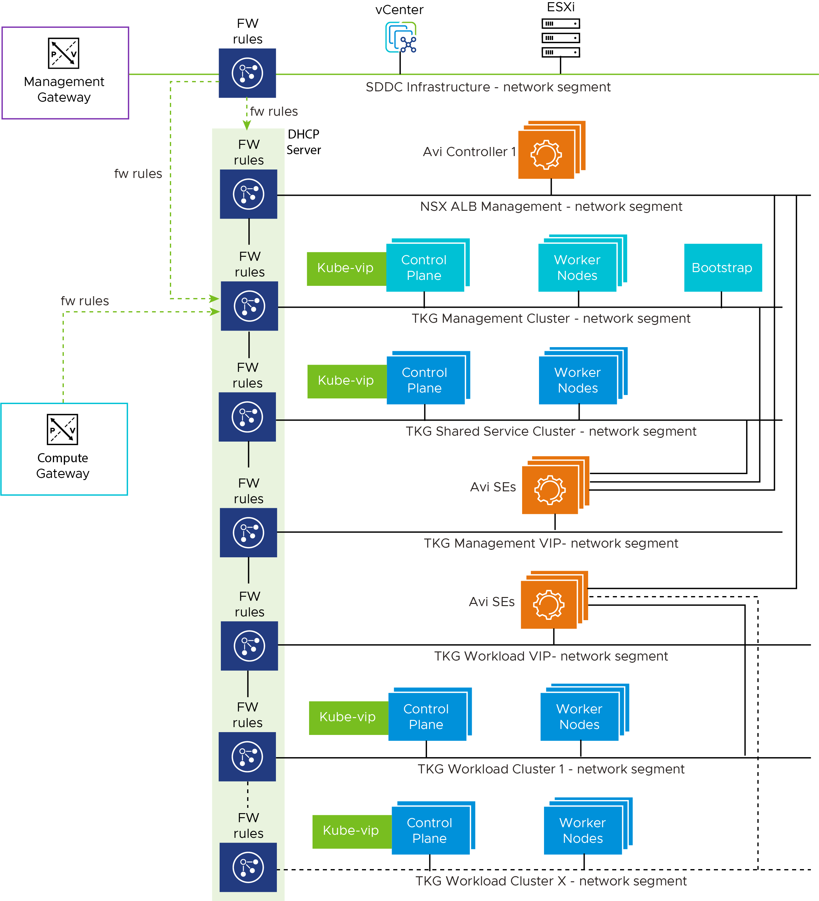

# Deploying VMware Tanzu for Kubernetes Operations on VMware Cloud on AWS Using Service Installer for VMware Tanzu
The following provides the steps for deploying Tanzu for Kubernetes Operations on VMware Cloud on AWS using Service Installer for VMware Tanzu.

This deployment references the design provided in [VMware Tanzu for Kubernetes Operations on VMware Cloud on AWS Reference Design](https://docs.vmware.com/en/VMware-Tanzu/services/tanzu-reference-architecture/GUID-reference-designs-tko-on-vmc-aws.html).

## Network Design
The following diagram represents the network design required for deploying Tanzu for Kubernetes Operations on VMware Cloud on AWS using Service Installer for VMware Tanzu.



## Prerequisites
Before deploying Tanzu for Kubernetes Operations on VMware Cloud on AWS using Service Installer for VMware Tanzu, ensure the following:

- A Software-Defined Data Center (SDDC) is running in VMC on an AWS instance.
- A public IP address is reserved in VMC on AWS.

   A public IP address is required for bootstrapping VMs and VMware Tanzu Kubernetes Grid nodes to talk to external networks.

   For information about requesting a public IP address on VMware Cloud, see [Request or Release a Public IP Address](https://docs.vmware.com/en/VMware-Cloud-on-AWS/services/com.vmware.vmc-aws-networking-security/GUID-0E34C56D-C49C-49B6-A9CF-FBFAF14A126C.html).

- You have installed Service Installer for VMware Tanzu.

   For information on how to download and deploy VMware Service Installer for VMware Tanzu, see [Service Installer for VMware Tanzu](../index.md).

## Overview of Steps
The following are the main steps for deploying VMware Tanzu for Kubernetes  Operations on VMware Cloud on AWS using Service Installer for VMware Tanzu:

1. [Create a Network Segment](#create-network-segment)
1. [Enable External Access](#enable-external-access)
1. [Download NSX Advanced Load Balancer Controller](#download-avi-controller)
1. [Deploy Tanzu for Kubernetes Operations](#deploy-tkg)

## <a id=create-network-segment> </a> Create a Network Segment
Create a network segment for Tanzu Kubernetes Grid. The Tanzu Kubernetes Grid management network segment is the only network that is configured manually. You attach the Service Installer for VMware Tanzu OVA to the Tanzu Kubernetes Grid management network. The installer deploys the Tanzu Kubernetes Grid management cluster to the network.

1. Log in to the [VMware Cloud Services](https://console.cloud.vmware.com/) portal.
1. Navigate to your **Organization**.
1. On the VMware Cloud service tile, click **Launch Service**.
1. Go to **Inventory**.
1. On the SDDC tile, click **View Details**.
1. Go to **Networking & Security** > **Network** > **Segments**.
1. Click **Add Segment** to create a new network segment with a unique subnet for the Tanzu Kubernetes Grid management network. Enter the following:

   - **Subnets:** Specify an IPv4 CIDR block for the segment. <br>
   Make sure that the new subnet CIDR does not overlap with `sddc-cgw-network-1` or any other existing segments.

   - **Set DHCP Config:** Configure DHCP settings.

     **Note**: Do not allocate all usable IPs under the DHCP range.  The Tanzu Kubernetes Grid management control plane requires an IP address outside the DHCP scope.

8. Click **Save**.

For additional product documentation, see [Create or Modify a Network Segment](https://docs.vmware.com/en/VMware-Cloud-on-AWS/services/com.vmware.vmc-aws-networking-security/GUID-267DEADB-BD01-46B7-82D5-B9AA210CA9EE.html).

## <a id=enable-external-access> </a> Enable External Access
Service Installer for VMware Tanzu acts as a bootstrap machine. Set up Internet access for the Service Installer VM from the VMware Cloud portal. The Service Installer VM needs a connection to VMware Public [Image Registry](https://projects.registry.vmware.com/) to pull the required container images for Tanzu Kubernetes Grid deployment.

1. Create and configure an inventory group for the bootstrap VM.

   1. Go to **Networking & Security** > **Inventory** > **Groups** > **Compute Groups**.
   1. Click **Add Group**.
   1. Under **Set Members**, provide the IP address of the Service Installer OVA.


2. Create a Firewall Rule.

   1. Go to **Networking & Security** > **Security** > **Gateway Firewall** > **Compute Gateway**.
   1. Click **Add Rule** to add a new rule.
   1. Enter the parameters for the new rule so that Service Installer OVA can communicate with DNS, NTP servers, and public networks. <br>

   Optionally, to access the Service Installer over SSH from an external network, create NAT and add the required firewall rules.

	  **Note**: This firewall rule is temporary. You can delete the rule after you create your Tanzu for Kubernetes Operations environment.

For additional product documentation, see [Add or Modify Compute Gateway Firewall Rules](https://docs.vmware.com/en/VMware-Cloud-on-AWS/services/com.vmware.vmc-aws-networking-security/GUID-2D31A9A6-4A80-4B5B-A382-2C5B591F6AEB.html?).

## <a id=download-avi-controller> </a> Download and Import NSX Advanced Load Balancer Controller and Kubernetes Templates
Download the NSX Advanced Load Balancer Controller and base Kubernetes images.

1. Download and import the required Photon/Ubuntu Kubernetes base OVAs to vCenter.
    To download the images, go to [VMware Tanzu Kubernetes Grid Download Product](https://customerconnect.vmware.com/downloads/details?downloadGroup=TKG-154&productId=988&rPId=84961).

1. After importing the images, convert the images to a template.
1. Upload the NSX Advanced Load Balancer Controller OVA:
   1. Download the NSX Advanced Load Balancer (20.1.7) OVA from [MarketPlace](https://marketplace.cloud.vmware.com/services/details/nsx-advanced-load-balancer-1?slug=true).
   2. Create a Content Library and upload the NSX Advanced Load Balancer Controller OVA.

**Note**: 
   - As part of automation for VMC deployment, SIVT uploads NSX Advanced Load Balancer Controller and base Kubernetes images to vCenter/ESXi after the necessary firewall rules are configured. All required firewall rules are configured by the SIVT automation code.
   - If you intend to upload these images from the SIVT VM even before executing the `--vmc_pre_configuration` command, you may need to add the required ESXi Inbound rule in Management Gateway manually.

## <a id=deploy-tkg> </a> Deploy Tanzu for Kubernetes Operations
1. Log in to the Service Installer for VMware Tanzu VM over SSH.

    Enter `ssh root@Service-Installer-IP`.

2. Configure and verify NTP.

   To configure and verify NTP on a Photon OS, see [VMware KB-76088](https://kb.vmware.com/s/article/76088).

3. Import a certificate and private key to the Service Installer for VMware Tanzu bootstrap VM using a copy utility such as SCP or WinSCP (for Windows).

   **Note:** Service Installer uses the certificate for NSX Advanced Load Balancer, Harbor, Prometheus, and Grafana. Ensure that the certificate and private key are in PEM format and are not encrypted. Encrypted certificate files are not supported. If you do not upload a certificate, Service Installer generates a self-signed certificate.

4. Enter the following in a browser window to access the Service Installer user interface:

    `http://<IP of Service Installer VM>:8888/`

5. On the **VMC on AWS** tile, click **Deploy**.
6. On the **Configure and Generate JSON** tile, click **Proceed**.

    By default, the values entered in the GUI are saved in the `vmc-tkgm.json` file located at `/opt/vmware/arcas/src`.

    See the [sample JSON file](#sample-input-file) file for reference.
7. Execute the following command to initiate the deployment:
     ```
     arcas --env vmc --file /path/to/vmc-tkgm.json --session --vmc_pre_configuration --avi_configuration --tkg_mgmt_configuration --shared_service_configuration --workload_preconfig --workload_deploy --deploy_extensions
     ```
     For `/path/to/vmc-tkgm.json`, enter the path to the JSON file that you created in the previous step.

8. Use the following command to cleanup the deployment.

     ```
     arcas --env  vmc --file /path/to/vmc-tkgm.json --cleanup
     ```

     The following table describes the parameters of the command.

     Python CLI Command Parameter         | Description                                                  |
     ------------------------------------ | ------------------------------------------------------------ |
     --session                            | Establishes a session with CSP/VMC and performs pre-validation |
     --vmc_pre_configuration              | Creates the required segments, firewalls rules, inventory groups, and services|
     --avi_configuration                  | Creates the resource pool and folders for NSX Advanced Load Balancer Controller <br> Deploys Avi Control Plane, generates & replaces certs and performs initial configuration (DNS,NTP)                                                    |
     --tkg_mgmt_configuration             | Configures the required networks in Avi, creates the cloud, SE group, and IPAM profile, and maps IPAM & SE group with Cloud <br> Creates the resource pool and folders for TKG Mgmt Cluster <br> Deploys the TKG management cluster <br> Registers the TKG management cluster with TMC|
     --shared_service_configuration       | Deploys Shared Service cluster(Makes use of TMC CLI)<br> Adds required tags to the cluster <br> Deploys Certmanager, Contour, and Harbor        |
     --workload_preconfig                 | Creates the required network configuration in Avi, creates a new SE Groups for Workload Clusters <br> Creates a new AKO config for Workload Clusters |
     --workload_deploy                    | Deploys a workload cluster (uses the Tanzu Mission Control CLI) <br> Adds required tags to the cluster            |
     --deploy_extensions                  | Deploys extensions (Prometheus, Grafana)                      |
     | --cleanup 			 | cleanup the deployment performed by SIVT and start from scratch |
     | --verbose 			| Enables verbose logging |


9. Do the following to integrate with SaaS services such as Tanzu Mission Control, Tanzu Service Mesh, and Tanzu Observability. In the `vmc-tkgm.json` file,

    - to enable or disable Tanzu Mission Control, enter `"tanzuObservabilityAvailability": "true/false"`.
    - to enable or disable Tanzu Service Mesh, enter `"tkgWorkloadTsmIntegration": "true/false"`.
    - to enable or disable Tanzu Observability, enter `"tanzuObservabilityAvailability": "true/false"`.

    **Note:** If you edit the JSON manually, ensure that the values you enter are in quotes.

10. Enable or disable Tanzu Kubernetes Grid extensions. For example,
    - to enable or disable Prometheus and Grafana, enter `"enableExtensions": "true/false"`.
    - to enable or disable Harbor, enter `"enableHarborExtension": "true/false"`.

**Note:**

- Tanzu Mission Control is required to enable Tanzu Service Mesh and Tanzu Observability.
- If Tanzu Observability is enabled, Prometheus and Grafana are not supported.
- When Tanzu Mission Control is enabled only Photon is supported.

## Update a Running Extension Deployment

To make changes to the configuration of a running package after deployment, update your deployed package:

1. Obtain the installed package version and namespace details using the following command. 
   ```
   tanzu package available list -A
   ```

2. Update the package configuration `<package-name>-data-values.yaml` file. Yaml files for the extensions deployed using SIVT are available under `/opt/vmware/arcas/tanzu-clusters/<cluster-name>` in the SIVT VM.

3. Update the installed package using the following command.

   ``` 
   tanzu package installed update <package-name> --version <installed-package-version> --values-file <path-to-yaml-file-in-SIVT> --namespace <package-namespace>
   ```

**Refer to the following example for Grafana update:**

**Step 1:** List the installed package version and namespace details.
   ```
   # tanzu package available list -A
   / Retrieving installed packages...
   NAME            PACKAGE-NAME                     PACKAGE-VERSION          STATUS               NAMESPACE
   cert-manager    cert-manager.tanzu.vmware.com    1.1.0+vmware.1-tkg.2     Reconcile succeeded  my-packages
   contour         contour.tanzu.vmware.com         1.17.1+vmware.1-tkg.1    Reconcile succeeded  my-packages
   grafana         grafana.tanzu.vmware.com         7.5.7+vmware.1-tkg.1     Reconcile succeeded  tkg-system
   prometheus      prometheus.tanzu.vmware.com      2.27.0+vmware.1-tkg.1    Reconcile succeeded  tkg-system
   antrea          antrea.tanzu.vmware.com                                   Reconcile succeeded  tkg-system
   [...]
   ```

**Step 2:** Update the Grafana configuration in the `grafana-data-values.yaml` file available under `/opt/vmware/arcas/tanzu-clusters/<cluster-name>/grafana-data-values.yaml`. 

**Step 3:** Update the installed package.
   ```
   tanzu package installed update grafana --version 7.5.7+vmware.1-tkg.1 --values-file /opt/vmware/arcas/tanzu-clusters/testCluster/grafana-data-values.yaml --namespace my-packages
   ```
   Expected Output:
   ```
   | Updating package 'grafana'
   - Getting package install for 'grafana'
   | Updating secret 'grafana-my-packages-values'
   | Updating package install for 'grafana'

   Updated package install 'grafana' in namespace 'my-packages'
   ```

For information about updating, see [Update a Package](https://docs.vmware.com/en/VMware-Tanzu-Kubernetes-Grid/1.5/vmware-tanzu-kubernetes-grid-15/GUID-packages-cli-reference-packages.html#update-a-package-13).


## <a id="sample-input-file"> </a> Sample Input File
Service Installer automatically generates the JSON file for deploying Tanzu Kubernetes Grid. The following following sample file is an example of an automatically generated JSON file.

**Note:** The sample file is also available in the Service Installer VM at the following location: **/opt/vmware/arcas/src/vmc/vmc-tkgm.json.sample**.

```json
{
   "envSpec":{
      "sddcRefreshToken":"n06OXXXXXXXXXX",
      "orgName":"Tanzu",
      "sddcName":"Sver1",
      "sddcDatacenter":"SDDC-Datacenter",
      "sddcCluster":"Cluster-1",
      "sddcDatastore":"Workload-Datastore",
      "contentLibraryName":"SDDC-Local",
      "aviOvaName":"ALB-20.1.7-9154",
      "resourcePoolName":""
   },
   "marketplaceSpec":{
      "refreshToken":""
   },
   "envVariablesSpec":{
      "dnsServersIp":"",
      "searchDomains":"tanzu.lab",
      "ntpServersIp":""
   },
   "saasEndpoints":{
      "tmcDetails":{
         "tmcAvailability":"true",
         "tmcRefreshToken":"t9TfXXXXJuMCq3",
	 "tmcInstanceURL": "https://xxxx.tmc.com"
      },
      "tanzuObservabilityDetails":{
         "tanzuObservabilityAvailability":"true",
         "tanzuObservabilityUrl":"https://surf.wavefront.com",
         "tanzuObservabilityRefreshToken":"6777a3a8-XXXX-XXXX-XXXXX-797b20638660"
      }
   },
   "componentSpec":{
      "aviMgmtNetworkSpec":{
         "aviMgmtGatewayCidr":"11.12.13.14/24",
         "aviMgmtDhcpStartRange":"11.12.13.15",
         "aviMgmtDhcpEndRange":"11.12.13.28"
      },
      "aviComponentSpec":{
         "aviPasswordBase64":"Vk13YXJlMSE=",
         "aviBackupPassPhraseBase64":"Vk13YXJlMSE=",
         "enableAviHa":"false",
         "aviClusterIp":"",
         "aviClusterFqdn":"",
         "aviSize":"essentials",
         "aviCertPath":"",
         "aviCertKeyPath":""
      },
      "identityManagementSpec":{
         "identityManagementType":"oidc",
         "oidcSpec":{
            "oidcIssuerUrl":"https://xxx.xxx.com",
            "oidcClientId":"0xxxxxxx3a",
            "oidcClientSecret":"xxxxxxxxxxxxxxxxg",
            "oidcScopes":"email",
            "oidcUsernameClaim":"email",
            "oidcGroupsClaim":"group"
         },
         "ldapSpec":{
            "ldapEndpointIp":"",
            "ldapEndpointPort":"",
            "ldapBindPWBase64":"",
            "ldapBindDN":"",
            "ldapUserSearchBaseDN":"",
            "ldapUserSearchFilter":"",
            "ldapUserSearchUsername":"",
            "ldapGroupSearchBaseDN":"",
            "ldapGroupSearchFilter":"",
            "ldapGroupSearchUserAttr":"",
            "ldapGroupSearchGroupAttr":"",
            "ldapGroupSearchNameAttr":"",
            "ldapRootCAData":""
         }
      },
      "tkgClusterVipNetwork":{
         "tkgClusterVipNetworkGatewayCidr":"11.12.15.14/24",
         "tkgClusterVipDhcpStartRange":"11.12.15.15",
         "tkgClusterVipDhcpEndRange":"11.12.15.28",
         "tkgClusterVipIpStartRange":"11.12.15.30",
         "tkgClusterVipIpEndRange":"11.12.15.40"
      },
      "tkgMgmtSpec":{
         "tkgMgmtNetworkName":"TKG-Management",
         "tkgMgmtGatewayCidr":"11.12.16.14/24",
         "tkgMgmtClusterName":"mgmt-cluster",
         "tkgMgmtSize":"medium",
         "tkgMgmtDeploymentType":"dev",
         "tkgMgmtClusterCidr":"100.96.0.0/11",
         "tkgMgmtServiceCidr":"100.64.0.0/13",
         "tkgMgmtBaseOs":"photon",
         "tkgMgmtRbacUserRoleSpec":{
            "clusterAdminUsers":"",
            "adminUsers":"",
            "editUsers":"",
            "viewUsers":""
         },
         "tkgMgmtClusterGroupName":"default"
      },
      "tkgSharedServiceSpec":{
         "tkgSharedGatewayCidr":"11.12.17.14/24",
         "tkgSharedDhcpStartRange":"11.12.17.15",
         "tkgSharedDhcpEndRange":"11.12.17.30",
         "tkgSharedClusterName":"shared-cluster",
         "tkgSharedserviceSize":"large",
         "tkgSharedserviceDeploymentType":"dev",
         "tkgSharedserviceWorkerMachineCount":"1",
         "tkgSharedserviceClusterCidr":"100.96.0.0/11",
         "tkgSharedserviceServiceCidr":"100.64.0.0/13",
         "tkgSharedserviceBaseOs":"photon",
         "tkgSharedserviceKubeVersion":"v1.21.8",
         "tkgSharedserviceRbacUserRoleSpec":{
            "clusterAdminUsers":"user1@mail.com",
            "adminUsers":"user2@mail.com",
            "editUsers":"",
            "viewUsers":""
         },
         "tkgSharedserviceClusterGroupName":"default",
         "tkgSharedserviceEnableDataProtection":"false",
         "tkgSharedClusterCredential":"",
         "tkgSharedClusterBackupLocation":""
      },
      "tkgMgmtDataNetworkSpec":{
         "tkgMgmtDataGatewayCidr":"11.12.18.14/24",
         "tkgMgmtDataDhcpStartRange":"11.12.18.15",
         "tkgMgmtDataDhcpEndRange":"11.12.18.30",
         "tkgMgmtDataServiceStartRange":"11.12.18.31",
         "tkgMgmtDataServiceEndRange":"11.12.18.40"
      },
      "tkgWorkloadDataNetworkSpec":{
         "tkgWorkloadDataGatewayCidr":"11.12.19.14/24",
         "tkgWorkloadDataDhcpStartRange":"11.12.19.15",
         "tkgWorkloadDataDhcpEndRange":"11.12.19.30",
         "tkgWorkloadDataServiceStartRange":"11.12.19.31",
         "tkgWorkloadDataServiceEndRange":"11.12.19.40"
      },
      "tkgWorkloadSpec":{
         "tkgWorkloadGatewayCidr":"11.12.20.14/24",
         "tkgWorkloadDhcpStartRange":"11.12.20.15",
         "tkgWorkloadDhcpEndRange":"11.12.20.30",
         "tkgWorkloadClusterName":"workload-cluster",
         "tkgWorkloadSize":"large",
         "tkgWorkloadDeploymentType":"dev",
         "tkgWorkloadWorkerMachineCount":"1",
         "tkgWorkloadClusterCidr":"100.96.0.0/11",
         "tkgWorkloadServiceCidr":"100.64.0.0/13",
         "tkgWorkloadBaseOs":"photon",
         "tkgWorkloadKubeVersion":"v1.22.5",
         "tkgWorkloadTsmIntegration":"false",
         "namespaceExclusions":{
            "exactName":"",
            "startsWith":""
         },
         "tkgWorkloadRbacUserRoleSpec":{
            "clusterAdminUsers":"user1@mail.com",
            "adminUsers":"user2@mail.com",
            "editUsers":"",
            "viewUsers":""
         },
         "tkgWorkloadClusterGroupName":"default",
         "tkgWorkloadEnableDataProtection":"false",
         "tkgWorkloadClusterCredential":"",
         "tkgWorkloadClusterBackupLocation":""
      },
      "harborSpec":{
         "enableHarborExtension":"false",
         "harborFqdn":"harbor.xx.xx",
         "harborPasswordBase64":"cGFzc3dvcmQ=",
         "harborCertPath":"",
         "harborCertKeyPath":""
      }
   },
   "tanzuExtensions":{
      "enableExtensions":"false",
      "tkgClustersName":"",
      "logging":{
         "syslogEndpoint":{
            "enableSyslogEndpoint":"false",
            "syslogEndpointAddress":"",
            "syslogEndpointPort":"",
            "syslogEndpointMode":"",
            "syslogEndpointFormat":""
         },
         "httpEndpoint":{
            "enableHttpEndpoint":"false",
            "httpEndpointAddress":"",
            "httpEndpointPort":"",
            "httpEndpointUri":"",
            "httpEndpointHeaderKeyValue":"Authorization Bearer Axxxxxxxxxxxxxx"
         },
         "kafkaEndpoint":{
            "enableKafkaEndpoint":"false",
            "kafkaBrokerServiceName":"",
            "kafkaTopicName":""
         }
      },
      "monitoring":{
         "enableLoggingExtension":"false",
         "prometheusFqdn":"",
         "prometheusCertPath":"",
         "prometheusCertKeyPath":"",
         "grafanaFqdn":"",
         "grafanaCertPath":"",
         "grafanaCertKeyPath":"",
         "grafanaPasswordBase64":""
      }
   }
}
```
