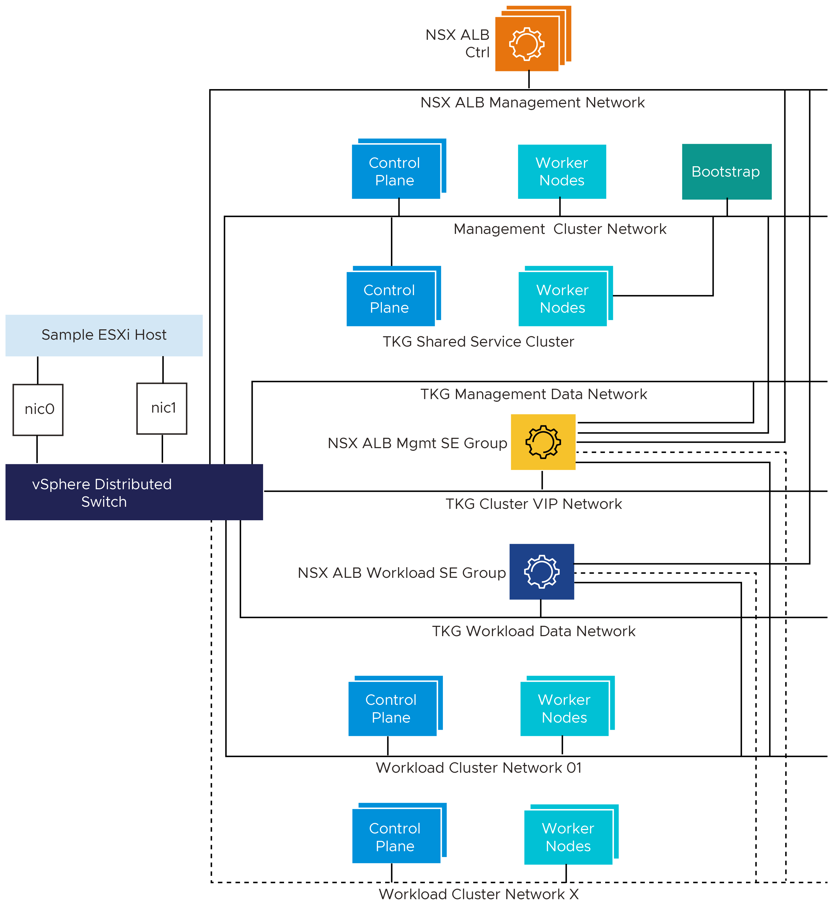

# Deploying VMware Tanzu for Kubernetes Operations on vSphere with vSphere Distributed Switch Using Service Installer for VMware Tanzu
The following provides the steps for deploying VMware Tanzu for Kubernetes Operations on vSphere with vSphere Distributed Switch using Service Installer for VMware Tanzu.

This deployment uses Tanzu Kubernetes Grid and references the design provided in [VMware Tanzu for Kubernetes Operations on vSphere Reference Design](https://docs.vmware.com/en/VMware-Tanzu/services/tanzu-reference-architecture/GUID-reference-designs-tko-on-vsphere.html).

## Network Design
The following diagram represents the network design required for installing and running Service Installer for VMware Tanzu on vSphere with vSphere Distributed Switch.



## Prerequisites
Before you deploy Tanzu for Kubernetes Operations using Service Installer for VMware Tanzu, ensure the following:

-  You have created the following port groups:
    -   Management port group/NSX Advanced Load Balancer management: You will connect the VMware NSX Advanced Load Balancer Controller and an interface of NSX Advanced Load Balancer Service Engines (SEs) to this port group.
    -   Tanzu Kubernetes Grid management: The bootstrap VM, Tanzu Kubernetes Grid management cluster nodes, Tanzu Kubernetes Grid shared services cluster, and an interface of NSX Advanced Load Balancer SEs part of SE Group 01 will be connected to this port group.
    -   Tanzu Kubernetes Grid management Data/VIP: All Kubernetes load balancer services are exposed to the external network through this network. Only Tanzu Kubernetes Grid shared services clusters use this network. An interface of NSX Advanced Load Balancer SEs part of SE Group 01 will be connected to this port groups.  

        IPAM of this network is handled by NSX Advanced Load Balancer and IP addresses are assigned to both VIPs and SEs.

    -   Tanzu Kubernetes Grid workload cluster: Tanzu Kubernetes Grid workload cluster nodes and an interface of NSX Advanced Load Balancer SEs part of SE Group 02 are connected to this port group.

    -   Tanzu Kubernetes Grid workload data/VIP: All Kubernetes load balancer services are exposed to the external network through this network. Multiple workload clusters can make use of this group.  

        NSX Advanced Load Balancer handles the IPAM of this network. The IP addresses are assigned to both VIPs and SEs.

- DHCP service is available on the following networks. The networks must have external access to the Internet.

    -   Tanzu Kubernetes Grid management port group
    -   Tanzu Kubernetes Grid workload clusters port group

    IP addresses are assigned to Tanzu Kubernetes Grid nodes and SEs. DHCP must provide the default Gateway and NTP server details.

- Reserve a block of IP addresses for SEs and VIPs on the networks. IPAM is handled by NSX Advanced Load Balancer.

    -   Tanzu Kubernetes Grid management data/VIP
    -   Tanzu Kubernetes Grid workload data/VIP
    -   Management/NSX Advanced Load Balancer management

- To allow Service Installer to automatically download the required images, such as NSX Advanced Load Balancer Controller and Kubernetes base images, from VMware Marketplace.

    - A Cloud Services Portal (CSP) API token is required to pull all required images from VMware Marketplace. To generate an API token, login in to the CSP portal and select your organization. Go to **Marketplace Service > My Account > API Tokens > Generate a Token**.
    - If Marketplace is not available in your environment or if you are working in an air-gapped environment,

        1. Download and import required Photon/Ubuntu Kubernetes base OVAs to vCenter.

            To download the images, go to [VMware Tanzu Kubernetes Grid Download Product](https://customerconnect.vmware.com/downloads/details?downloadGroup=TKG-154&productId=988&rPId=84961).

        1. Convert the imported images to a template.
        1. Upload the NSX Advanced Load Balancer Controller and Kubernetes OVA:

           1. Create a Content Library and upload NSX Advanced Load Balancer Controller OVA (20.1.6).
           1. Download the NSX Advanced Load Balancer OVA from [MarketPlace](https://marketplace.cloud.vmware.com/services/details/nsx-advanced-load-balancer-1?slug=true).

        2. A centralized image repository with the required images to deploy the Tanzu Kubernetes clusters in an Internet restricted environments.

            For instructions to set up an Harbor image registry and publish required images, see [Prepare an Internet-Restricted Environment](https://docs.vmware.com/en/VMware-Tanzu-Kubernetes-Grid/1.4/vmware-tanzu-kubernetes-grid-14/GUID-mgmt-clusters-airgapped-environments.html).

- (Optional) If you use a custom certificate for deploying Harbor on shared services cluster, import the certificate and private key to the Service Installer VM. The certificate and private key must be in PEM format.

- DNS Name resolution for NSX Advanced Load Balancer Controller.

- You have installed Service Installer for VMware Tanzu.

   For information on how to download and deploy Service Installer for VMware Tanzu, see [Service Installer for VMware Tanzu](../../index.md).

## Ports for Tanzu for Kubernetes Operations Deployment

Source                               | Destination                         | Protocol & Port |
------------------------------------ | ----------------------------------- | --------------- | 								 
TKG Management and Workload Networks | DNS & NTP                           | UDP: 53 and 123 |
TKG Management and Workload Networks | DHCP Server                         | UDP: 67, 68     |
TKG Management and Workload Networks | vCenter Server                      | TCP: 443        |
TKG Management and Workload Networks | Any                                 | TCP: 443        |
TKG Management Cluster Network       | TKG Cluster VIP Network             | TCP: 6443       |
TKG Workload Cluster Network         | TKG Cluster VIP Network             | TCP: 6443       |
TKG Management and Workload Networks | NSX Advanced Load Balancer Controllers                     | TCP: 443        |
NSX Advanced Load Balancer Controllers                      | vCenter and ESXi Hosts              | TCP: 443        |
Admin System                         | Service Instaler VM                 | SSH: 22         |
Service installer VM                 | any                                 | TCP: 443        |
Service installer VM                 | TKG Management and Workload Network | TCP: 6443       |
Service installer VM                 | vCenter                             | TCP: 443        |
Service installer VM                 | NSX Advanced Load Balancer Controller                      | TCP: 443        |

## Considerations
Consider the following when deploying VMware Tanzu for Kubernetes Operations using Service Installer for VMware Tanzu.

- If you set HTTP proxy, you must also set HTTPS proxy and vice-versa.
    - NSX Advanced Load Balancer Controller must be able to communicate with vCenter directly without a proxy.
    - Avi Kubernetes Operator (AKO) must be able to communicate with NSX Advanced Load Balancer Controller directly without proxy.
    - For the no-proxy section in the JSON file, in addition to the values you specify, Service Installer appends:

        - localhost and 127.0.0.1 on the Service Installer bootstrap VM.
        - localhost, 127.0.0.1, values for CLUSTER_CIDR and SERVICE_CIDR, .svc, and .svc.cluster.local  for Tanzu Kubernetes Grid management and workload clusters.

    - If the Kubernetes clusters or Service Installer VMs need to communicate with external services and infrastructure endpoints in your Tanzu Kubernetes Grid environment, ensure that those endpoints are reachable by your proxies or add them to TKG_NO_PROXY. Depending on your environment configuration, this may include, but is not limited to, your OIDC or LDAP server, Harbor, NSX-T, and NSX Advanced Load Balancer for deployments on vSphere.

      For vSphere, you manually add the CIDR of the TKG_MGMT network, which includes the IP address of your control plane endpoint, to TKG_NO_PROXY. If you set VSPHERE_CONTROL_PLANE_ENDPOINT to an FQDN, add both the FQDN and VSPHERE_NETWORK to TKG_NO_PROXY.

- Tanzu Mission Control is required to enable Tanzu Service Mesh and Tanzu Observability.
- Since Tanzu Observability also provides observability services, if Tanzu Observability is enabled, Prometheus and Grafana are not supported.
- In an Internet-restricted environment, provide custom repository details. The registry must not implement user authentication. For example, if you use a Harbor registry, the project must be public and not private.

## <a id=deploy-tko></a> Deploy Tanzu for Kubernetes Operations

1. Log in to the Service Installer for VMware Tanzu VM over SSH.

   Enter `ssh root@Service-Installer-IP`.

2. Configure and verify NTP.

   To configure and verify NTP on a Photon OS, see VMware [KB-76088](https://kb.vmware.com/s/article/76088).
3. Import a certificate and private key to the Service Installer for VMware Tanzu bootstrap VM using a copy utility such as SCP or WinSCP (for Windows).

    **Note:** Service Installer uses the certificate for NSX Advanced Load Balancer, Harbor, Prometheus, and Grafana. Ensure that the certificate and private key are in PEM format and are not encrypted as **encrypted certificate files are not supported.** Alternatively, if you do not upload a certificate, Service Installer generates a self-signed certificate.
4. Log in to Service Installer at http://\<_service-installer-ip-address_>\:8888.
5. Under **VMware vSphere with DVS**, click **Deploy Tanzu Kubernetes Grid**.
6. Under **Configure and Generate JSON**, click **Proceed**.

  **Note**: To make use of an existing JSON file, click **Proceed** under **Upload and Re-configure JSON**.

7. Enter the required details to generate the input file. For reference, see the [sample JSON file](#sample-input-file).
8. Execute the following command to initiate the deployment.

   ```
   arcas --env vsphere --file /path/to/vsphere_data.json --avi_configuration --tkg_mgmt_configuration --shared_service_configuration --workload_preconfig --workload_deploy --deploy_extensions
   ```
9. Use the following command to clean up the deployment.
   ```
   arcas --env vsphere --file /path/to/vsphere_data.json --cleanup
   ```

   The following table describes the parameters.

   Python CLI Command Parameter         | Description                                                  |
   ------------------------------------ | ------------------------------------------------------------ |
   --avi_configuration                  | Creates the resource pool and folders for NSX Advanced Load Balancer Controller <br> Deploys AVI Control Plane, generates & replaces certs and performs initial configuration (DNS,NTP)       |
   --tkg_mgmt_configuration             | Configures required networks in AVI, creates cloud, SE group, IPAM profile, and maps IPAM & SE group with Cloud  <br> Creates resource pool and folders for Tanzu Kubernetes Grid management Cluster  <br>  Deploys Tanzu Kubernetes Grid management cluster  <br> Registers Tanzu Kubernetes Grid Mgmt cluster with TMC                          |
   --shared_service_configuration       | Deploys Shared Service cluster (makes use of Tanzu or TMC CLI) <br> Adds required tags to the cluster <br> Deploys Certmanager, Contour, and Harbor|
   --workload_preconfig                 | Configures required network configuration in AVI, creates a new SE Group for Workload Clusters <br> Creates a new AKO config for workload clusters|
   --workload_deploy                    | Deploys a workload cluster (makes use of Tanzu or TMC CLI) <br> Adds required tags to the cluster |
   --deploy_extensions                  | Deploy extensions (Prometheus, Grafana)                      |
   --cleanup                            | cleanup the deployment performed by SIVT and start from scratch |
   --verbose                            | Enable verbose logging.          |

2. Do the following to integrate with SaaS services such as Tanzu Mission Control, Tanzu Service Mesh, and Tanzu Observability. In the JSON file:

    - to enable or disable Tanzu Mission Control and to use the Tanzu Mission Control CLI and API enter `"tmcAvailability": "true/false"`.
    - to enable or disable Tanzu Service Mesh, enter `"tkgWorkloadTsmIntegration": "true/false"`.
    - to enable or disable Tanzu Observability, enter `"tanzuObservabilityAvailability": "true/false"`.

3. If you are using a proxy, configure the proxy details in the proxy field corresponding to the cluster.

    For example, to enable or disable proxy on the management cluster, use `tkgMgmt: {"enable-proxy": "true"}` in the JSON file.

4. Enable or disable Tanzu Kubernetes Grid extensions. For example,
    - to enable or disable Prometheus and Grafana, enter `"enableExtensions": "true/false"`.
    - to enable or disable Harbor, enter `"enableHarborExtension": "true/false"`.   

**Note:**
- Tanzu Mission Control is required to enable Tanzu Service Mesh and Tanzu Observability.
- If Tanzu Observability is enabled, Prometheus and Grafana are not supported.
- When Tanzu Mission Control is enabled only Photon is supported.


## Update a Running Extension Deployment

To make changes to the configuration of a running package after deployment, update your deployed package:

1. Obtain the installed package version and namespace details using the following command. 
   ```
   tanzu package available list -A
   ```

2. Update the package configuration `<package-name>-data-values.yaml` file. Yaml files for the extensions deployed using SIVT are available under `/opt/vmware/arcas/tanzu-clusters/<cluster-name>` in the SIVT VM.

3. Update the installed package using the following command.

   ``` 
   tanzu package installed update <package-name> --version <installed-package-version> --values-file <path-to-yaml-file-in-SIVT> --namespace <package-namespace>
   ```

**Refer to the following example for Grafana update:**

**Step 1:** List the installed package version and namespace details.
   ```
   # tanzu package available list -A
   / Retrieving installed packages...
   NAME            PACKAGE-NAME                     PACKAGE-VERSION          STATUS               NAMESPACE
   cert-manager    cert-manager.tanzu.vmware.com    1.1.0+vmware.1-tkg.2     Reconcile succeeded  my-packages
   contour         contour.tanzu.vmware.com         1.17.1+vmware.1-tkg.1    Reconcile succeeded  my-packages
   grafana         grafana.tanzu.vmware.com         7.5.7+vmware.1-tkg.1     Reconcile succeeded  tkg-system
   prometheus      prometheus.tanzu.vmware.com      2.27.0+vmware.1-tkg.1    Reconcile succeeded  tkg-system
   antrea          antrea.tanzu.vmware.com                                   Reconcile succeeded  tkg-system
   [...]
   ```

**Step 2:** Update the Grafana configuration in the `grafana-data-values.yaml` file available under `/opt/vmware/arcas/tanzu-clusters/<cluster-name>/grafana-data-values.yaml`. 

**Step 3:** Update the installed package.
   ```
   tanzu package installed update grafana --version 7.5.7+vmware.1-tkg.1 --values-file /opt/vmware/arcas/tanzu-clusters/testCluster/grafana-data-values.yaml --namespace my-packages
   ```
   Expected Output:
   ```
   | Updating package 'grafana'
   - Getting package install for 'grafana'
   | Updating secret 'grafana-my-packages-values'
   | Updating package install for 'grafana'

   Updated package install 'grafana' in namespace 'my-packages'
   ```

For information about updating, see [Update a Package](https://docs.vmware.com/en/VMware-Tanzu-Kubernetes-Grid/1.5/vmware-tanzu-kubernetes-grid-15/GUID-packages-cli-reference-packages.html#update-a-package-13).

## <a id="sample-input-file"> </a> Sample Input File
The Service Installer user interface generates the JSON file based on your inputs and saves it to **/opt/vmware/arcas/src/** in Service Installer VM. Files are named based on the environment:

 - vSphere DVS Internet environment: vsphere-dvs-tkgm.json
 - vSphere DVS Proxy environment: vsphere-dvs-tkgm-proxy.json
 - vSphere DVS air-gapped environment: vsphere-dvs-tkgm-airgapped.json


 Following is an example of the JSON file.

 **Note:** The sample JSON file is also available in Service Installer VM at the following location: **/opt/vmware/arcas/src/vsphere/vsphere-dvs-tkgm.json.sample**.

```json
{
   "envSpec":{
      "vcenterDetails":{
         "vcenterAddress":"vcenter.xx.xx",
         "vcenterSsoUser":"administrator@vsphere.local",
         "vcenterSsoPasswordBase64":"cGFzc3dvcmQ=",
         "vcenterDatacenter":"Datacenter-1",
         "vcenterCluster":"Cluster-1",
         "vcenterDatastore":"Datastore-1",
         "contentLibraryName":"TanzuAutomation-Lib",
         "aviOvaName":"avi-controller",
         "resourcePoolName":""
      },
      "envType":"tkgm",
      "marketplaceSpec":{
         "refreshToken":"t9TfXXXXJuMCq3"
      },
      "customRepositorySpec":{
         "tkgCustomImageRepository":"https://harbor-local.xx.xx/tkg151",
         "tkgCustomImageRepositoryPublicCaCert":"false"
      },
      "saasEndpoints":{
         "tmcDetails":{
            "tmcAvailability":"false",
            "tmcRefreshToken":"t9TfXXXXJuMCq3",
            "tmcInstanceURL":"https://xxxx.tmc.com"
         },
         "tanzuObservabilityDetails":{
            "tanzuObservabilityAvailability":"false",
            "tanzuObservabilityUrl":"https://surf.wavefront.com",
            "tanzuObservabilityRefreshToken":"6777a3a8-XXXX-XXXX-XXXXX-797b20638660"
         }
      },
      "infraComponents":{
         "dnsServersIp":"x.x.x.x",
         "ntpServers":"x.x.x.x",
         "searchDomains":".xx.xx"
      },
      "proxySpec":{
         "arcasVm":{
            "enableProxy":"false",
            "httpProxy":"http://<fqdn/ip>:<port>",
            "httpsProxy":"https://<fqdn/ip>:<port>",
            "noProxy":"vcenter.xx.xx,172.x.x.x"
         },
         "tkgMgmt":{
            "enableProxy":"false",
            "httpProxy":"http://<fqdn/ip>:<port>",
            "httpsProxy":"https://<fqdn/ip>:<port>",
            "noProxy":""
         },
         "tkgSharedservice":{
            "enableProxy":"false",
            "httpProxy":"http://<fqdn/ip>:<port>",
            "httpsProxy":"https://<fqdn/ip>:<port>",
            "noProxy":"vcenter.xx.xx,172.x.x.x"
         },
         "tkgWorkload":{
            "enableProxy":"false",
            "httpProxy":"http://<fqdn/ip>:<port>",
            "httpsProxy":"https://<fqdn/ip>:<port>",
            "noProxy":"vcenter.xx.xx,172.x.x.x"
         }
      }
   },
   "tkgComponentSpec":{
      "aviMgmtNetwork":{
         "aviMgmtNetworkName":"nsx_alb_management_pg",
         "aviMgmtNetworkGatewayCidr":"11.12.1.14/24",
         "aviMgmtServiceIpStartRange":"11.12.1.14",
         "aviMgmtServiceIpEndRange":"11.12.1.28"
      },
      "tkgClusterVipNetwork":{
         "tkgClusterVipNetworkName":"tkg_cluster_vip_pg",
         "tkgClusterVipNetworkGatewayCidr":"11.12.2.14",
         "tkgClusterVipIpStartRange":"11.12.2.14",
         "tkgClusterVipIpEndRange":"11.12.2.28"
      },
      "aviComponents":{
         "aviPasswordBase64":"cGFzc3dvcmQ=",
         "aviBackupPassphraseBase64":"cGFzc3dvcmQ=",
         "enableAviHa":"true",
         "aviController01Ip":"11.12.1.18",
         "aviController01Fqdn":"avi.xx.xx",
         "aviController02Ip":"11.12.1.15",
         "aviController02Fqdn":"avi2.xx.xx",
         "aviController03Ip":"11.12.1.16",
         "aviController03Fqdn":"avi3.xx.xx",
         "aviClusterIp":"11.12.1.17",
         "aviClusterFqdn":"avi4.xx.xx",
         "aviSize":"essentials",
         "aviCertPath":"",
         "aviCertKeyPath":""
      },
      "identityManagementSpec":{
         "identityManagementType":"",
         "oidcSpec":{
            "oidcIssuerUrl":"",
            "oidcClientId":"",
            "oidcClientSecret":"",
            "oidcScopes":"",
            "oidcUsernameClaim":"",
            "oidcGroupsClaim":""
         },
         "ldapSpec":{
            "ldapEndpointIp":"",
            "ldapEndpointPort":"",
            "ldapBindPWBase64":"",
            "ldapBindDN":"",
            "ldapUserSearchBaseDN":"",
            "ldapUserSearchFilter":"",
            "ldapUserSearchUsername":"",
            "ldapGroupSearchBaseDN":"",
            "ldapGroupSearchFilter":"",
            "ldapGroupSearchUserAttr":"",
            "ldapGroupSearchGroupAttr":"",
            "ldapGroupSearchNameAttr":"",
            "ldapRootCAData":""
         }
      },
      "tkgMgmtComponents":{
         "tkgMgmtNetworkName":"tkg_mgmt_pg",
         "tkgMgmtGatewayCidr":"11.12.3.14/24",
         "tkgMgmtClusterName":"Mgmt-cluster",
         "tkgMgmtSize":"custom",
         "tkgMgmtCpuSize":"2",
         "tkgMgmtMemorySize":"16",
         "tkgMgmtStorageSize":"290",
         "tkgMgmtDeploymentType":"prod",
         "tkgMgmtClusterCidr":"100.96.0.0/11",
         "tkgMgmtServiceCidr":"100.64.0.0/13",
         "tkgMgmtBaseOs":"photon",
         "tkgMgmtRbacUserRoleSpec":{
            "clusterAdminUsers":"",
            "adminUsers":"",
            "editUsers":"",
            "viewUsers":""
         },
         "tkgMgmtClusterGroupName":"",
         "tkgSharedserviceClusterName":"shared-cluster",
         "tkgSharedserviceSize":"custom",
         "tkgSharedserviceCpuSize":"2",
         "tkgSharedserviceMemorySize":"16",
         "tkgSharedserviceStorageSize":"290",
         "tkgSharedserviceDeploymentType":"prod",
         "tkgSharedserviceWorkerMachineCount":"3",
         "tkgSharedserviceClusterCidr":"100.96.0.0/11",
         "tkgSharedserviceServiceCidr":"100.64.0.0/13",
         "tkgSharedserviceBaseOs":"photon",
         "tkgSharedserviceKubeVersion":"v1.22.5",
         "tkgSharedserviceRbacUserRoleSpec":{
            "clusterAdminUsers":"",
            "adminUsers":"",
            "editUsers":"",
            "viewUsers":""
         },
         "tkgSharedserviceClusterGroupName":"",
         "tkgSharedserviceEnableDataProtection":"false",
         "tkgSharedClusterCredential":"",
         "tkgSharedClusterBackupLocation":""
      }
   },
   "tkgMgmtDataNetwork":{
      "tkgMgmtDataNetworkName":"tkg_mgmt_vip_pg",
      "tkgMgmtDataNetworkGatewayCidr":"11.12.4.14/24",
      "tkgMgmtAviServiceIpStartRange":"11.12.4.14",
      "tkgMgmtAviServiceIpEndRange":"11.12.4.28"
   },
   "tkgWorkloadDataNetwork":{
      "tkgWorkloadDataNetworkName":"tkg_workload_vip_pg",
      "tkgWorkloadDataNetworkGatewayCidr":"11.12.5.14/24",
      "tkgWorkloadAviServiceIpStartRange":"11.12.5.14",
      "tkgWorkloadAviServiceIpEndRange":"11.12.5.28"
   },
   "tkgWorkloadComponents":{
      "tkgWorkloadNetworkName":"tkg_workload_pg",
      "tkgWorkloadGatewayCidr":"11.12.6.14/24",
      "tkgWorkloadClusterName":"tkg-workload-rk1901",
      "tkgWorkloadSize":"custom",
      "tkgWorkloadCpuSize":"2",
      "tkgWorkloadMemorySize":"16",
      "tkgWorkloadStorageSize":"290",
      "tkgWorkloadDeploymentType":"prod",
      "tkgWorkloadWorkerMachineCount":"3",
      "tkgWorkloadClusterCidr":"100.96.0.0/11",
      "tkgWorkloadServiceCidr":"100.64.0.0/13",
      "tkgWorkloadBaseOs":"photon",
      "tkgWorkloadKubeVersion":"v1.21.8",
      "tkgWorkloadRbacUserRoleSpec":{
         "clusterAdminUsers":"",
         "adminUsers":"",
         "editUsers":"",
         "viewUsers":""
      },
      "tkgWorkloadTsmIntegration":"false",
      "namespaceExclusions":{
         "exactName":"",
         "startsWith":""
      },
      "tkgWorkloadClusterGroupName":"",
      "tkgWorkloadEnableDataProtection":"false",
      "tkgWorkloadClusterCredential":"",
      "tkgWorkloadClusterBackupLocation":""
   },
   "harborSpec":{
      "enableHarborExtension":"true",
      "harborFqdn":"harbor.xx.tk",
      "harborPasswordBase64":"cGFzc3dvcmQ=",
      "harborCertPath":"/root/cert.pem",
      "harborCertKeyPath":"/root/key.pem"
   },
   "tanzuExtensions":{
      "enableExtensions":"true",
      "tkgClustersName":"tkg-workload-rk1901",
      "logging":{
         "syslogEndpoint":{
            "enableSyslogEndpoint":"false",
            "syslogEndpointAddress":"",
            "syslogEndpointPort":"",
            "syslogEndpointMode":"",
            "syslogEndpointFormat":""
         },
         "httpEndpoint":{
            "enableHttpEndpoint":"false",
            "httpEndpointAddress":"",
            "httpEndpointPort":"",
            "httpEndpointUri":"",
            "httpEndpointHeaderKeyValue":"Authorization Bearer Axxxxxxxxx"
         },
         "kafkaEndpoint":{
            "enableKafkaEndpoint":"false",
            "kafkaBrokerServiceName":"",
            "kafkaTopicName":""
         }
      },
      "monitoring":{
         "enableLoggingExtension":"true",
         "prometheusFqdn":"promethus.xx.vmw",
         "prometheusCertPath":"/root/cert.pem",
         "prometheusCertKeyPath":"/root/key.pem",
         "grafanaFqdn":"grafana.xx.vmw",
         "grafanaCertPath":"/root/cert.pem",
         "grafanaCertKeyPath":"/root/key.pem",
         "grafanaPasswordBase64":"cGFzc3dvcmQ="
      }
   }
}
```
