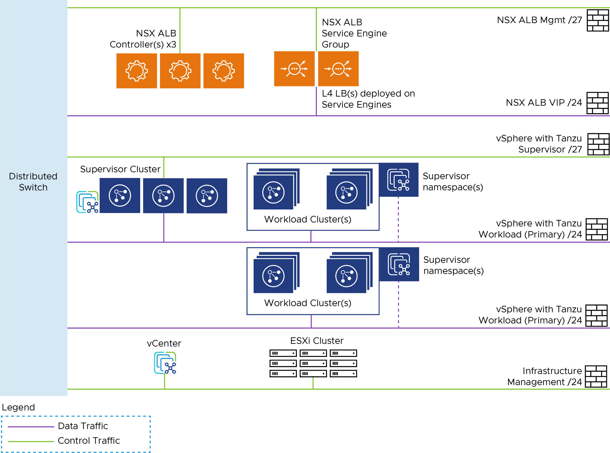

# Deploying VMware Tanzu for Kubernetes Operations on vSphere with Tanzu and vSphere Distributed Switch Using Service Installer for VMware Tanzu
The following provides the steps for deploying VMware Tanzu for Kubernetes Operations on vSphere with vSphere Distributed Switch using Service Installer for VMware Tanzu.

This deployment uses Tanzu Kubernetes Grid Service and references the design provided in [VMware Tanzu for Kubernetes Operations using vSphere with Tanzu Reference Design](https://docs.vmware.com/en/VMware-Tanzu/services/tanzu-reference-architecture/GUID-reference-designs-tko-on-vsphere-with-tanzu.html).

## Network Design
The following diagram represents the network design required for installing and running Service Installer for VMware Tanzu on vSphere with Tanzu and vSphere Distributed Switch (VDS).



## Prerequisites
Before you deploy Tanzu for Kubernetes Operations using Service Installer for VMware Tanzu, ensure the following:

-  You have created the following port groups:
    -   NSX Advanced Load Balancer management: You will connect the VMware NSX Advanced Load Balancer Controller and an interface of NSX Advanced Load Balancer Service Engines (SEs) to this port group. Alternatively, you can also place NSX Advanced Load Balancer Controllers on the existing infrastructure management network.
    -   Tanzu Kubernetes Grid management: Network to which Supervisor Cluster VMs are connected.
    -   Tanzu Kubernetes Grid management Data/VIP: Network through which all Kubernetes L4/L7 load balancer services are exposed to the external network. IPAM of this network is handled by NSX Advanced Load Balancer. IP addresses are assigned to both VIPs and SEs.
    -   Tanzu Kubernetes Grid workload cluster: Network to which Tanzu Kubernetes Grid Service Workload Cluster nodes (control plane and worker) are connected. This network is defined when you create vSphere Namespaces after enabling the workload control plane (WCP). The first workload network is also called Primary Workload Network.
	  -   Tanzu Kubernetes Grid workload network X: Another network to which Tanzu Kubernetes Grid workload cluster nodes (control plane and worker) are connected. You can create additional workload networks based on your requirements.

- To allow Service Installer to automatically download NSX Advanced Load Balancer Controller from VMware Marketplace,
   	- A Cloud Services Portal API token is required to pull all required images from VMware Marketplace. To generate an API token, log in to the CSP portal and select your organization. Go to **Marketplace Service > My Account > API Tokens > Generate a Token**.
    - If Marketplace is not available in the environment,
        1. Download the NSX Advanced Load Balancer OVA from [VMware Vault](https://vault.vmware.com/group/nsx/avi-networks-technical-resources).
        2. Create a Content Library and upload NSX Advanced Load Balancer Controller OVA (20.1.6 for vSphere 7.0 Update2 and 20.1.7 for vSphere 7.0 Update3).

## Firewall Requirements:
To prepare the firewall, gather the following:
1.  NSX ALB Management Network CIDR
2.	NSX ALB Controller node IP address
3.	NSX ALB Service Engine management & data IP address
4.	Supervisor Cluster network (Tanzu Kubernetes Grid management cluster) CIDR
5.	Supervisor Cluster VIP address
7.	Tanzu Kubernetes Cluster (Workload Cluster) CIDR.
8.	vCenter Server IP address
10.	DNS server IP(s)
11.	NTP Server(s)

The following table provides the port information.

Source                                   | Destination                         | Protocol & Port    |
-----------------------------------------|-------------------------------------| ------------------ |
TKG Management and Workload Cluster CIDR | DNS Server                          | UDP: 53 and UDP:53 |
TKG Management and Workload Cluster CIDR | NTP Server                          | UDP: 123, 68       |
TKG Management and Workload Cluster CIDR | vCenter IP                          | TCP: 443           |
TKG Management and Workload Cluster CIDR | NSX ALB Management Network          | TCP: 443           |
TKG Management and Workload Cluster CIDR | Internet                            | TCP: 443           |
TKG Workload Cluster CIDR                | Supervisor Cluster VIP address      | TCP: 6443          |
TKG Management Cluster CIDR              | Workload Cluster VIP address        | TCP: 6443          |
NSX ALB Management Network               | vCenter and ESXi Hosts              | TCP: 443           |
NSX ALB Management Network               | DNS Server  <br>  NTP Server        | UDP:53  <br> UDP: 123          |
NSX ALB Controller Nodes                 | NSX ALB Controller Nodes            | TCP: 8443 <br> TCP: 22 <br> TCP: 443         |
NSX ALB Service Engine Management IP     | NSX ALB Controller Nodes            | TCP: 443           |

## <a id=deploy-tko></a> Deploy Tanzu for Kubernetes Operations

1. Log in to the Service Installer for VMware Tanzu VM over SSH.

   Enter `ssh root@Service-Installer-IP`.
2. Configure and verify NTP.

   To configure and verify NTP on a Photon OS, see VMware [KB-76088](https://kb.vmware.com/s/article/76088).
3. Import a certificate and private key to the Service Installer for VMware Tanzu bootstrap VM using a copy utility such as SCP or WinSCP (for windows).

    **Note:** Service Installer uses the certificate for NSX Advanced Load Balancer, Harbor, Prometheus, and Grafana. Ensure that the certificate and private key are in PEM format and are not encrypted. Encrypted certificate files are not supported. If you do not upload a certificate, Service Installer generates a self-signed certificate.
4. Log in to Service Installer at http://\<_service-installer-ip-address_>\:8888.
5. Under **Tanzu on VMware vSphere with DVS**, click **Deploy**.
6. Under **Tanzu on vSphere - Deployment stage selection**, select the deployment type either **Enable Workload Control Plane** or **Namespace and Workload cLuster**
7. Under **Configure and Generate JSON**, click **Proceed**.  

  **Note**: To use an existing JSON file, click **Proceed** under **Upload and Re-configure JSON**.
8. Enter the required details to generate the input file.

    The Service Installer user interface generates the JSON file based on your inputs and saves it to **/opt/vmware/arcas/src/** in installer VM. Files are named based on the deployment type you choose.

    - Enable workload control plane (WCP): vsphere-dvs-tkgs-wcp.json
    - Namespace and workload - vsphere-dvs-tkgs-namespace.json<br/>

    See the [sample json files](#sample-input-file) file for reference<br/>

10. Execute the following command to initiate the deployment.

    **To Enable Workload Control Plane**

    ```
    arcas --env vsphere --file /path/to/vsphere-dvs-tkgs-wcp.json --avi_configuration --avi_wcp_configuration --enable_wcp --verbose
    ```

    **To Deploy Supervisor Namespace and Workload Clusters**

    ```
    arcas --env vsphere --file /path/to/vsphere-dvs-tkgs-namespace.json --create_supervisor_namespace --create_workload_cluster --deploy_extentions --verbose
    ```
11. Use below command if you wish to cleanup the deployment
    ```
    arcas --env vsphere --file /path/to/vsphere-dvs-tkgs-wcp.json --cleanup
    ```
    **Note:** For vSphere on Tanzu, cleanup is performed by disabling Workload Control Plane (WCP) on cluster. Hence, provide WCP deployment file for performing cleanup

    The following table describes the parameters.

    |Python CLI Command Parameter | Description |
    |------------------------------ | ----------- |
    |--avi_configuration | Creates the resource pool and folders for NSX Advanced Load Balancer Controller  Deploys AVI Control Plane, generates & replaces certificates and performs the initial configuration (DNS,NTP)|
    |--avi_wcp_configuration | AVI cloud, Network and SE configuration for Workload Control Plane (WCP) configuration |
    |--enable_wcp | Enables Workload Control Plane on a vSphere Cluster |
    |--create_supervisor_namespace | Creates Supervisor Namespace |
    |--create_workload_cluster  | Creates Tanzu Kubernetes Clusters (TKC) |
    |--deploy_extentions | Deploys extensions (Harbor, Prometheus, Grafana) |
    | --cleanup | cleanup the deployment performed by SIVT and start from scratch |
    |--verbose | Log Verbosity |


11. Do the following to integrate with SaaS services such as Tanzu Mission Control, Tanzu Service Mesh, and Tanzu Observability. In the JSON file, to enable or disable,

    - Tanzu Mission Control and to use the Tanzu Mission Control CLI and API, enter `"tmcAvailability": "true/false"`.
    - Tanzu Service Mesh, enter `"tkgWorkloadTsmIntegration": "true/false"`.

    - Tanzu Observability, enter `"tanzuObservabilityAvailability": "true/false"`.


12. Enable or disable Tanzu Kubernetes Grid extensions. For example, to enable or disable,

    - Prometheus and Grafana, enter `"enableExtensions": "true/false"`.
    - Harbor, enter `"enableHarborExtension": "true/false"`.  

**Note:**  

- Tanzu Mission Control is required to enable Tanzu Service Mesh and Tanzu Observability.
- Since Tanzu Observability also provides observability services, if Tanzu Observability is enabled, Prometheus and Grafana are not supported.

## Sample Input File

Following are the sample JSON files:
- [Enable Workload Control Plane (WCP)](#enable-wcp)
- [Namespace and Workload Creation](#namespace-worload-creation)

**Note:** The sample files are also available in the Service Installer VM under `/opt/vmware/arcas/src/vsphere/vsphere-dvs-tkgs-wcp.json.sample` and `/opt/vmware/arcas/src/vsphere/vsphere-dvs-tkgs-namespace.json.sample`**


### <a id="enable-wcp"> </a>Enable Workload Control Plane

 ```json
 {
   "envSpec":{
      "envType":"tkgs-wcp",
      "vcenterDetails":{
         "vcenterAddress":"vcenter.xx.xx",
         "vcenterSsoUser":"administrator@vsphere.local",
         "vcenterSsoPasswordBase64":"cGFzc3dvcmQ=",
         "vcenterDatacenter":"Datacenter-1",
         "vcenterCluster":"Cluster-1",
         "vcenterDatastore":"Datastore-1",
         "contentLibraryName":"",
         "aviOvaName":""
      },
      "marketplaceSpec":{
         "refreshToken":"t9TfXXXXJuMCq3"
      },
      "saasEndpoints":{
         "tmcDetails":{
            "tmcAvailability":"false",
            "tmcRefreshToken":"t9TfXXXXJuMCq3",
            "tmcSupervisorClusterName":"supervisor-cluster",
            "tmcInstanceURL": "https://xxxx.tmc.com",
            "tmcSupervisorClusterGroupName": "default"
         }
      },
      "infraComponents":{
         "dnsServersIp":"1.2.3.4",
         "searchDomains":"xx.xx",
         "ntpServers":"time.xx.com"
      }
   },
   "tkgsComponentSpec":{
      "controlPlaneSize":"SMALL",
      "aviMgmtNetwork":{
         "aviMgmtNetworkName":"NSX-ALB-Mgmt",
         "aviMgmtNetworkGatewayCidr":"11.12.14.15/24",
         "aviMgmtServiceIpStartRange":"11.12.14.16",
         "aviMgmtServiceIpEndRange":"11.12.14.28"
      },
      "aviComponents":{
         "aviPasswordBase64":"cGFzc3dvcmQ=",
         "aviBackupPassphraseBase64":"cGFzc3dvcmQ=",
         "enableAviHa":"false",
         "aviController01Ip":"11.12.14.17",
         "aviController01Fqdn":"avi.xx.xx",
         "aviController02Ip":"",
         "aviController02Fqdn":"",
         "aviController03Ip":"",
         "aviController03Fqdn":"",
         "aviClusterIp":"",
         "aviClusterFqdn":"",
         "aviSize":"essentials",
         "aviCertPath":"",
         "aviCertKeyPath":""
      },
      "tkgsVipNetwork":{
         "tkgsVipNetworkName":"NSX-ALB-VIP",
         "tkgsVipNetworkGatewayCidr":"11.12.16.15/24",
         "tkgsVipIpStartRange":"11.12.16.16",
         "tkgsVipIpEndRange":"11.12.16.28"
      },
      "tkgsMgmtNetworkSpec":{
         "tkgsMgmtNetworkName":"TKGS-Mgmt",
         "tkgsMgmtNetworkGatewayCidr":"11.12.17.15/24",
         "tkgsMgmtNetworkStartingIp":"11.12.17.16",
         "tkgsMgmtNetworkDnsServers":"11.12.17.28",
         "tkgsMgmtNetworkSearchDomains":"tanzu.xx",
         "tkgsMgmtNetworkNtpServers":"x.x.x.x"
      },
      "tkgsStoragePolicySpec":{
         "masterStoragePolicy":"vSAN Default Storage Policy",
         "ephemeralStoragePolicy":"vSAN Default Storage Policy",
         "imageStoragePolicy":"vSAN Default Storage Policy"
      },
      "tkgsPrimaryWorkloadNetwork":{
         "tkgsPrimaryWorkloadPortgroupName":"TKGS-Workload",
         "tkgsPrimaryWorkloadNetworkName":"tkgs-workload",
         "tkgsPrimaryWorkloadNetworkGatewayCidr":"11.12.18.15/24",
         "tkgsPrimaryWorkloadNetworkStartRange":"11.12.18.16",
         "tkgsPrimaryWorkloadNetworkEndRange":"11.12.18.28",
         "tkgsWorkloadDnsServers":"1.2.3.4",
         "tkgsWorkloadNtpServers":"time.xx.com",
         "tkgsWorkloadServiceCidr":"10.96.0.0/22"
      }
   }
}


 ```

### <a id="namespace-worload-creation"> </a> Namespace and Workload Creation

```json
{
   "envSpec":{
      "envType":"tkgs-ns",
      "vcenterDetails":{
         "vcenterAddress":"vcenter.lab.vmw",
         "vcenterSsoUser":"administrator@vsphere.local",
         "vcenterSsoPasswordBase64":"Vk13YXJlMSE=",
         "vcenterDatacenter":"Tanzu-DC",
         "vcenterCluster":"Tanzu-CL01"
      },
      "saasEndpoints":{
         "tmcDetails":{
            "tmcAvailability":"false",
            "tmcRefreshToken":"t9TfXXXXJuMCq3",
            "tmcSupervisorClusterName":"supervisor-cluster",
            "tmcInstanceURL":"https://xxxx.tmc.com"
         },
         "tanzuObservabilityDetails":{
            "tanzuObservabilityAvailability":"false",
            "tanzuObservabilityUrl":"6777a3a8-XXXX-XXXX-XXXXX-797b20638660",
            "tanzuObservabilityRefreshToken":"6777a3a8-XXXX-XXXX-XXXXX-797b20638660"
         }
      }
   },
   "tkgsComponentSpec":{
      "tkgsWorkloadNetwork":{
         "tkgsWorkloadNetworkName":"tkgs-workload",
         "tkgsWorkloadPortgroupName":"",
         "tkgsWorkloadNetworkGatewayCidr":"",
         "tkgsWorkloadNetworkStartRange":"",
         "tkgsWorkloadNetworkEndRange":"",
         "tkgsWorkloadServiceCidr":""
      },
      "tkgsVsphereNamespaceSpec":{
         "tkgsVsphereNamespaceName":"workload",
         "tkgsVsphereNamespaceDescription":"",
         "tkgsVsphereNamespaceContentLibrary":"",
         "tkgsVsphereNamespaceVmClasses":[
            "best-effort-2xlarge",
            "best-effort-4xlarge",
            "best-effort-large"
         ],
         "tkgsVsphereNamespaceResourceSpec":{
            "cpuLimit":"10000",
            "memoryLimit":"51200",
            "storageRequestLimit":"102400"
         },
         "tkgsVsphereNamespaceStorageSpec":[
            {
               "storageLimit":"204800",
               "storagePolicy":"vSAN Default Storage Policy"
            }
         ],
         "tkgsVsphereWorkloadClusterSpec":{
            "tkgsVsphereNamespaceName":"workload",
            "tkgsVsphereWorkloadClusterName":"workload-cls",
            "tkgsVsphereWorkloadClusterVersion":"v1.21.6+vmware.1-tkg.1.b3d708a",
            "allowedStorageClasses":[
               "vSAN Default Storage Policy"
            ],
            "defaultStorageClass":"vSAN Default Storage Policy",
            "nodeStorageClass":"vSAN Default Storage Policy",
            "serviceCidrBlocks":"192.168.0.0/16",
            "podCidrBlocks":"10.96.0.0/12",
            "controlPlaneVmClass":"best-effort-large",
            "workerVmClass":"best-effort-large",
            "workerNodeCount":"3",
            "enableControlPlaneHa":"true",
            "tkgWorkloadTsmIntegration":"false",
            "namespaceExclusions":{
               "exactName":"",
               "startsWith":""
            },
            "tkgsWorkloadClusterGroupName":"",
            "tkgsWorkloadEnableDataProtection":"false",
            "tkgWorkloadClusterCredential":"",
            "tkgWorkloadClusterBackupLocation":""
         }
      }
   },
   "harborSpec":{
      "enableHarborExtension":"true",
      "harborFqdn":"harbor.tanzu.lab",
      "harborPasswordBase64":"Vk13YXJlMSE=",
      "harborCertPath":"/root/cert.pem",
      "harborCertKeyPath":"/root/key.pem"
   },
   "tanzuExtensions":{
      "enableExtensions":"true",
      "tkgClustersName":"workload-cls",
      "logging":{
         "syslogEndpoint":{
            "enableSyslogEndpoint":"false",
            "syslogEndpointAddress":"",
            "syslogEndpointPort":"",
            "syslogEndpointMode":"",
            "syslogEndpointFormat":""
         },
         "httpEndpoint":{
            "enableHttpEndpoint":"false",
            "httpEndpointAddress":"",
            "httpEndpointPort":"",
            "httpEndpointUri":"",
            "httpEndpointHeaderKeyValue":"Authorization Bearer Axxxxxxxxxxxxxx"
         },
         "kafkaEndpoint":{
            "enableKafkaEndpoint":"false",
            "kafkaBrokerServiceName":"",
            "kafkaTopicName":""
         }
      },
      "monitoring":{
         "enableLoggingExtension":"true",
         "prometheusFqdn":"prometheus.tanzu.lab",
         "prometheusCertPath":"/root/cert.pem",
         "prometheusCertKeyPath":"/root/key.pem",
         "grafanaFqdn":"grafana.tanzu.lab",
         "grafanaCertPath":"/root/cert.pem",
         "grafanaCertKeyPath":"/root/key.pem",
         "grafanaPasswordBase64":"Vk13YXJlMSE="
      }
   }
}

```

