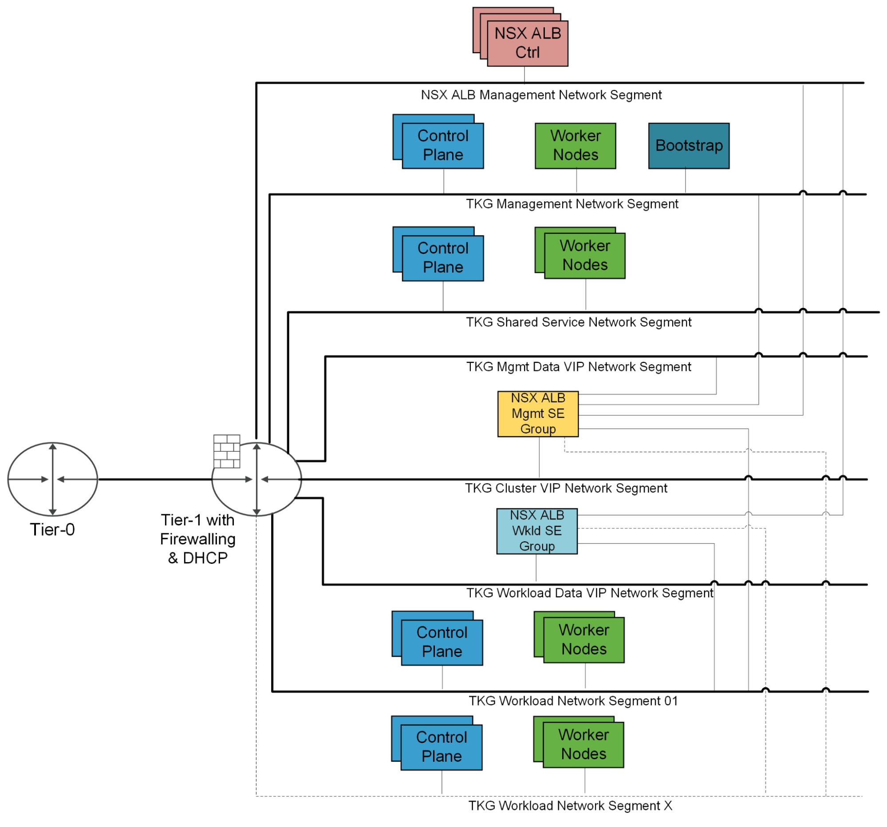

# Deploying VMware Tanzu for Kubernetes Operations on vSphere with NSX-T Using Service Installer for VMware Tanzu

The following provides the steps for installing Service Installer for VMware Tanzu on vSphere with NSX-T and setting up a Tanzu for Kubernetes Operations environment.

This deployment references the design provided in [VMware Tanzu for Kubernetes Operations on vSphere with NSX-T Reference Design](https://docs.vmware.com/en/VMware-Tanzu/services/tanzu-reference-architecture/GUID-reference-designs-tko-on-vsphere-nsx.html).

## Network Design
The following diagram represents the network design required for deploying Tanzu for Kubernetes Operations on vSphere with NSX-T using Service Installer for VMware Tanzu.



## Prerequisites
Before you install Service Installer for VMware Tanzu, ensure the following:

- A Tanzu Kubernetes Grid management port group exists. This is the network to which the bootstrap VM, Tanzu Kubernetes Grid management cluster nodes, Tanzu Kubernetes Grid shared service cluster, and the interface of the NSX Advanced Load Balancer SEs part of the SE Group 01 are connected.
    - The Service Installer creates all other port groups, such as Tanzu Kubernetes Grid management Data/VIP, Tanzu Kubernetes Grid workload, Tanzu Kubernetes Grid workload Data/VIP, and the NSX Advanced Load Balancer management PG, as well as groups and firewalls. You do not need to create these port groups.
    - The NSX Advanced Load Balancer handles the IPAM of the Tanzu Kubernetes Grid management PG network and assigns IP addresses to both VIPs and SE.

- The following networks have DHCP service and access to the Internet:

    - Tanzu Kubernetes Grid Management
    - Tanzu Kubernetes Grid Workload

    On the networks, reserve a few IP addresses that are outside the scope of DHCP. These IP addresses are for the control plane endpoints of the Tanzu clusters. The installer assigns the IP addresses to Tanzu Kubernetes Grid nodes and Service Engines (SEs). DHCP provides the default gateway.

- The following networks have an IP address block reserved for SEs and VIPs. VMware NSX Advanced Load Balancer handles IPAM.

    - Tanzu Kubernetes Grid management data/VIP
    - Tanzu Kubernetes Grid workload data/VIP
    - Management/Avi management network to which NSX Advanced Load Balancer Controllers are connected

- Service Installer can automatically download required images such as NSX Advanced Load Balancer Controller and Kubernetes base images from VMware Marketplace.

  - A Cloud Services Portal (CSP) API token is required to pull all required images from VMware Marketplace. To generate an API token, log in to the Cloud Services Portal and select your organization. Go to **Marketplace Service > My Account > API Tokens > Generate a Token**.
  - If Marketplace is not available in your environment or if you are working in an air-gapped environment:
      1. Download and import required Photon/Ubuntu Kubernetes base OVAs to vCenter.
            To download the images, go to [VMware Tanzu Kubernetes Grid Download Product](https://customerconnect.vmware.com/downloads/details?downloadGroup=TKG-151&productId=988&rPId=84961)
      1. After importing the images, convert the images to a template.
      1. Upload the NSX Advanced Load Balancer Controller in Content Library:
           1. Download the NSX Advanced Load Balancer 20.1.7 OVA from [VMware Vault](https://vault.vmware.com/group/nsx/avi-networks-technical-resources).
           2. Create a Content Library and upload the NSX Advanced Load Balancer Controller OVA.
      1. Set up a centralized image repository with the required images to deploy the Tanzu Kubernetes clusters in an internet-restricted environment. For instructions to set up a Harbor image registry and publish required images, see [Prepare an Internet-Restricted Environment](https://docs.vmware.com/en/VMware-Tanzu-Kubernetes-Grid/1.5/vmware-tanzu-kubernetes-grid-15/GUID-mgmt-clusters-airgapped-environments.html).

- (Optional) If you are using a custom certificate for deploying Harbor on a shared services cluster, import the certificate and private key to the Service Installer VM. The certificate and private key must be in PEM format.

- DNS Name resolution for NSX Advanced Load Balancer Controller.
- You have installed Service Installer for VMware Tanzu.

  For information on how to download and deploy Service Installer for VMware Tanzu, see [Service Installer for VMware Tanzu](../index.md).

## Considerations
Consider the following when deploying VMware Tanzu for Kubernetes Operations using Service Installer for VMware Tanzu.

- If you set http-proxy, you must also set https-proxy and vice-versa.
    - NSX Advanced Load Balancer Controller must be able to communicate with vCenter directly without a proxy.
    - Avi Kubernetes Operator (AKO) must be able to communicate with NSX Advanced Load Balancer Controller directly without a proxy.
    - Tanzu Mission Control integration is not supported when a proxy is enabled.
    - For the no-proxy value in the proxy-spec section in the JSON file, in addition to the values you specify, Service Installer appends:
        - localhost and 127.0.0.1 on the Service Installer bootstrap VM.
        - localhost, 127.0.0.1, values for CLUSTER_CIDR and SERVICE_CIDR, .svc, and .svc.cluster.local  for Tanzu Kubernetes Grid management and workload clusters.
    - If the Kubernetes clusters or Service Installer VMs need to communicate with external services and infrastructure endpoints in your Tanzu Kubernetes Grid environment, ensure that those endpoints are reachable by your proxies or add them to TKG_NO_PROXY. Depending on your environment configuration, this may include, but is not limited to, your OIDC or LDAP server, Harbor, NSX-T, and NSX Advanced Load Balancer for deployments on vSphere.
        - For vSphere, you manually add the CIDR of the TKG_MGMT network, which includes the IP address of your control plane endpoint, to TKG_NO_PROXY. If you set VSPHERE_CONTROL_PLANE_ENDPOINT to an FQDN, add both the FQDN and VSPHERE_NETWORK to TKG_NO_PROXY.
- Tanzu Mission Control is required to enable Tanzu Service Mesh and Tanzu Observability.
- Since Tanzu Observability also provides observability services, if Tanzu Observability is enabled, Prometheus and Grafana are not supported.

## <a id=deploy-tko></a> Deploy Tanzu for Kubernetes Operations

Do the following to deploy Tanzu for Kubernetes Operations using Service Installer for VMware Tanzu.

1. Enter ssh root@_Service-Installer-IP_ in a terminal window to log in to Service Installer for VMware Tanzu. Replace Service-Installer-IP with the IP address for your Service Installer installation.

2. Configure and verify NTP.

   To configure and verify NTP on a Photon OS, see VMware [KB-76088](https://kb.vmware.com/s/article/76088).

3. Import a certificate and private key to the Service Installer for VMware Tanzu bootstrap VM using a copy utility such as SCP or WinSCP (for Windows).

   **Note:** Service Installer uses the certificate for NSX Advanced Load Balancer, Harbor, Prometheus, and Grafana. Ensure that the certificate and private key are in PEM format and are not encrypted. Encrypted certificate files are not supported. If you do not upload a certificate, Service Installer generates a self-signed certificate.

3. Enter the following in a browser window to access the Service Installer user interface:

    `http://<IP of Service Installer VM>:8888/`

4. Enter the required details to generate the input file.

   After you have entered the required details, the Service Installer UI provides an option to review the values and download the input file in JSON format.

   The values are saved in a file `vsphere-nsxt-tkgm.json` located at `/opt/vmware/arcas/src`. See the [sample json file](#sample-input-file) file for reference.

5. Execute the following command to initiate the deployment.
   ```
   arcas --env vcf --file /path/to/vsphere-nsxt-tkgm.json  --vcf_pre_configuration --avi_configuration  --tkg_mgmt_configuration --shared_service_configuration --workload_preconfig --workload_deploy --deploy_extensions
   ```
   The following table describes the parameters.

   | Python CLI Command Parameter   | Description |
   | ------ | ------ |
   | --session   | Establishes a session with vCenter and performs pre-validation |
   | --vcf_pre_configuration   |  Creates segments, Firewalls rules, Inventory Groups and Services |
   | --avi_configuration | Creates the resource pool and folders for NSX Advanced Load Balancer Controller, deploys Avi control plane, generates and replaces certificates, and performs initial configuration (DNS, NTP) |
   | --tkg_mgmt_configuration | Configures the required networks in Avi, creates cloud, SE group, IPAM profile, and maps IPAM and SE groups with Cloud <br> Creates the resource pool and folders for Tanzu Kubernetes Grid Management cluster <br> Deploys Tanzu Kubernetes Grid management cluster <br> Registers Tanzu Kubernetes Grid management cluster with Tanzu Mission Control|
   | --shared_service_configuration | Deploys a shared service cluster (makes use of the Tanzu or Tanzu Mission Control CLI) <br> Adds required tags to the cluster <br> Deploys CertManager, Contour, and Harbor |
   | --workload_preconfig | Creates the required network configuration in Avi and creates new SE Groups for workload clusters <br> Creates a new AKO configuration for workload clusters |
   | --workload_deploy | Deploys a workload cluster (makes use of the Tanzu or Tanzu Mission Control CLI)) <br> Adds required tags to the cluster|
   | --deploy_extentions | Deploys extensions, such as Prometheus and Grafana |
   | --verbose | Enables verbose logging |

1. Do the following to integrate with SaaS services such as Tanzu Mission Control, Tanzu Service Mesh, and Tanzu Observability. In the `vsphere-nsxt-tkgm.json` file, to enable or disable,

   - Tanzu Mission Control and to use the Tanzu Mission Control CLI and API, enter `"tmcAvailability": "true/false"`.
   - Tanzu Service Mesh, enter `"ttkgWorkloadTsmIntegrationn": "true/false"`.
   - Tanzu Observability, enter `"tanzuObservabilityAvailability": "true/false"`.

    **Note:** If you edit the JSON manually, ensure that you enter the values in quotes.

1. If you are using a proxy, in the vsphere-nsxt-tkgm.json file, configure the details in the proxy field corresponding to the cluster.

    For example, to enable or disable proxies on the management cluster, use `tkgMgmt: {"enableProxy": "true"}` in the vsphere-nsxt-tkgm.json file.

1. Enable or disable Tanzu Kubernetes Grid extensions. For example, in the vsphere-nsxt-tkgm.json file, to enable or disable,

   -  Prometheus and Grafana, enter `"enableExtensions": "true/false"`.
   -  Harbor, enter `"enableHarborExtension": "true/false"`.

**Note:**
- Tanzu Mission Control is required to enable Tanzu Service Mesh and Tanzu Observability.
- If Tanzu Observability is enabled, Prometheus and Grafana are not supported.

## Sample Input file
 The Service Installer user interface generates the JSON file based on your inputs and saves it to **/opt/vmware/arcas/src/** in the installer VM. Files are named based on the environment you are using.

 - vSphere with NSX-T Internet environment: vsphere-nsxt-tkgm.json
 - vSphere with NSX-T Proxy environment: vsphere-nsxt-tkgm-proxy.json
 - vSphere with NSX-T Air-gapped environment: vsphere-nsxt-tkgm-airgapped.json

 Following is an example of the JSON file.

 **Note:** This sample file is also available in Service Installer VM at the following location: **/opt/vmware/arcas/src/vsphere/vsphere-nsxt-tkgm.json.sample**

```
{
    "envSpec": {
        "vcenterDetails": {
            "vcenterAddress": "vcenter.lab.vmw",
            "vcenterSsoUser": "administrator@lab.vmw",
            "vcenterSsoPasswordBase64": "Vk13YXJlQDEyMw==",
            "vcenterDatacenter": "arcas-nsxt-dc01",
            "vcenterCluster": "arcas-nsxt-c01",
            "vcenterDatastore": "vsanDatastore",
            "contentLibraryName": "TanzuAutomation-Lib",
            "aviOvaName": "controller-20.1.7-9154",
            "resourcePoolName": "arcas",
            "nsxtAddress": "nsxt.lab.vmw",
            "nsxtUser": "admin",
            "nsxtUserPasswordBase64": "Vk13YXJlMSFWTXdhcmUxIQ==",
            "nsxtTier1RouterDisplayName": "tier-1_gw",
            "nsxtOverlay": "arcas-overlay"
        },
        "marketplaceSpec": {
            "refreshToken": "t9TfXXXXJuMCq3"
        },
        "customRepositorySpec": {
            "tkgCustomImageRepository": "https://harbor-local.xx.vmw/tkg151",
            "tkgCustomImageRepositoryPublicCaCert": "false"
        },
        "saasEndpoints": {
            "tmcDetails": {
                "tmcAvailability": "true",
                "tmcRefreshToken": "t9TfXXXXJuMCq3"
            },
            "tanzuObservabilityDetails": {
                "tanzuObservabilityAvailability": "false",
                "tanzuObservabilityUrl": "https://surf.wavefront.com",
                "tanzuObservabilityRefreshToken": "6777a3a8-XXXX-XXXX-XXXXX-797b20638660"
            }
        },
        "infraComponents": {
            "dnsServersIp": "172.28.10.2",
            "searchDomains": "lab.vmw",
            "ntpServers": "172.28.10.2"
        },
        "proxySpec": {
            "arcasVm": {
                "enableProxy": "true",
                "httpProxy": "http://squid.lab.vmw:3128",
                "httpsProxy": "http://squid.lab.vmw:3128",
                "noProxy": "vcenter.lab.vmw,172.x.x.x,.lab.vmw"
            },
            "tkgMgmt": {
                "enableProxy": "true",
                "httpProxy": "http://squid.lab.vmw:3128",
                "httpsProxy": "http://squid.lab.vmw:3128",
                "noProxy": "vcenter.lab.vmw,172.x.x.x,.lab.vmw"
            },
            "tkgSharedservice": {
                "enableProxy": "false",
                "httpProxy": "http://squid.lab.vmw:3128",
                "httpsProxy": "http://squid.lab.vmw:3128",
                "noProxy": "vcenter.lab.vmw,172.x.x.x,.lab.vmw"
            },
            "tkgWorkload": {
                "enableProxy": "true",
                "httpProxy": "http://squid.lab.vmw:3128",
                "httpsProxy": "http://squid.lab.vmw:3128",
                "noProxy": "vcenter.lab.vmw,172.x.x.x,.lab.vmw"
            }
        }
    },
    "tkgComponentSpec": {
        "aviMgmtNetwork": {
            "aviMgmtNetworkName": "ran-avi-mgmt-02",
            "aviMgmtNetworkGatewayCidr": "192.168.150.1/24",
            "aviMgmtServiceIpStartRange": "192.168.150.100",
            "aviMgmtServiceIpEndRange": "192.168.150.200"
        },
        "tkgClusterVipNetwork": {
            "tkgClusterVipNetworkName": "ran-tkg-vip-02",
            "tkgClusterVipNetworkGatewayCidr": "192.168.160.1/24",
            "tkgClusterVipIpStartRange": "192.168.160.100",
            "tkgClusterVipIpEndRange": "192.168.160.200"
        },
        "aviComponents": {
            "aviPasswordBase64": "Vk13YXJlMSE=",
            "aviBackupPassphraseBase64": "Vk13YXJlMSE=",
            "enableAviHa": "false",
            "aviController01Ip": "192.168.150.10",
            "aviController01Fqdn": "avi.lab.vmw",
            "aviController02Ip": "",
            "aviController02Fqdn": "",
            "aviController03Ip": "",
            "aviController03Fqdn": "",
            "aviClusterIp": "",
            "aviClusterFqdn": "",
            "aviSize": "small",
            "aviCertPath": "",
            "aviCertKeyPath": ""
        },
        "tkgMgmtComponents": {
            "tkgMgmtNetworkName": "tkg_mgmt_pg-edit",
            "tkgMgmtGatewayCidr": "192.168.110.1/24",
            "tkgMgmtClusterName": "tkgm-mgmt-rashik-030322",
            "tkgMgmtSize": "custom",
            "tkgMgmtCpuSize": "2",
            "tkgMgmtMemorySize": "10",
            "tkgMgmtStorageSize": "45",
            "tkgMgmtDeploymentType": "dev",
            "tkgMgmtClusterCidr": "100.96.0.0/11",
            "tkgMgmtServiceCidr": "100.64.0.0/13",
            "tkgMgmtBaseOs": "photon"
        },
        "tkgSharedserviceSpec": {
            "tkgSharedserviceNetworkName": "ran-tkg-ss-02",
            "tkgSharedserviceGatewayCidr": "192.168.161.1/24",
            "tkgSharedserviceDhcpStartRange": "192.168.161.100",
            "tkgSharedserviceDhcpEndRange": "192.168.161.200",
            "tkgSharedserviceClusterName": "tkgm-shared-rashik-030322",
            "tkgSharedserviceSize": "large",
            "tkgSharedserviceCpuSize": "",
            "tkgSharedserviceMemorySize": "",
            "tkgSharedserviceStorageSize": "",
            "tkgSharedserviceDeploymentType": "dev",
            "tkgSharedserviceWorkerMachineCount": "1",
            "tkgSharedserviceClusterCidr": "100.96.0.0/11",
            "tkgSharedserviceServiceCidr": "100.64.0.0/13",
            "tkgSharedserviceBaseOs": "photon",
            "tkgSharedserviceKubeVersion": "v1.21.8"
        }
    },
    "tkgMgmtDataNetwork": {
        "tkgMgmtDataNetworkName": "ran-tkg-mgmt-vip-02",
        "tkgMgmtDataNetworkGatewayCidr": "192.168.152.1/24",
        "tkgMgmtAviServiceIpStartRange": "192.168.152.100",
        "tkgMgmtAviServiceIpEndRange": "192.168.152.200"
    },
    "tkgWorkloadDataNetwork": {
        "tkgWorkloadDataNetworkName": "ran-tkg-wkld-vip02",
        "tkgWorkloadDataNetworkGatewayCidr": "192.168.154.1/24",
        "tkgWorkloadAviServiceIpStartRange": "192.168.154.100",
        "tkgWorkloadAviServiceIpEndRange": "192.168.154.200"
    },
    "tkgWorkloadComponents": {
        "tkgWorkloadNetworkName": "ran-tkg-wkld03",
        "tkgWorkloadGatewayCidr": "192.168.157.1/24",
        "tkgWorkloadDhcpStartRange": "192.168.157.100",
        "tkgWorkloadDhcpEndRange": "192.168.157.200",
        "tkgWorkloadClusterName": "tkgm-workload-rashik-030322",
        "tkgWorkloadSize": "large",
        "tkgWorkloadCpuSize": "",
        "tkgWorkloadMemorySize": "",
        "tkgWorkloadStorageSize": "",
        "tkgWorkloadDeploymentType": "dev",
        "tkgWorkloadWorkerMachineCount": "1",
        "tkgWorkloadClusterCidr": "100.96.0.0/11",
        "tkgWorkloadServiceCidr": "100.64.0.0/13",
        "tkgWorkloadBaseOs": "photon",
        "tkgWorkloadKubeVersion": "v1.20.14",
        "tkgWorkloadTsmIntegration": "false",
        "namespaceExclusions": {
            "exactName": "",
            "startsWith": ""
        }
    },
    "harborSpec": {
        "enableHarborExtension": "true",
        "harborFqdn": "harbor.lab.vmw",
        "harborPasswordBase64": "Vk13YXJlMSE=",
        "harborCertPath": "/root/cert.pem",
        "harborCertKeyPath": "/root/key.pem"
    },
    "tanzuExtensions": {
        "enableExtensions": "false",
        "tkgClustersName": "",
        "logging": {
            "syslogEndpoint": {
                "enableSyslogEndpoint": "false",
                "syslogEndpointAddress": "",
                "syslogEndpointPort": "",
                "syslogEndpointMode": "",
                "syslogEndpointFormat": ""
            },
            "httpEndpoint": {
                "enableHttpEndpoint": "false",
                "httpEndpointAddress": "",
                "httpEndpointPort": "",
                "httpEndpointUri": "",
                "httpEndpointHeaderKeyValue": ""
            },
            "elasticSearchEndpoint": {
                "enableElasticSearchEndpoint": "false",
                "elasticSearchEndpointAddress": "",
                "elasticSearchEndpointPort": ""
            },
            "kafkaEndpoint": {
                "enableKafkaEndpoint": "false",
                "kafkaBrokerServiceName": "",
                "kafkaTopicName": ""
            },
            "splunkEndpoint": {
                "enableSplunkEndpoint": "false",
                "splunkEndpointAddress": "",
                "splunkEndpointPort": "",
                "splunkEndpointToken": ""
            }
        },
        "monitoring": {
            "enableLoggingExtension": "false",
            "prometheusFqdn": "prometheus.lab.vmw",
            "prometheusCertPath": "/root/cert.pem",
            "prometheusCertKeyPath": "/root/key.pem",
            "grafanaFqdn": "grafana.lab.vmw",
            "grafanaCertPath": "/root/cert.pem",
            "grafanaCertKeyPath": "/root/key.pem",
            "grafanaPasswordBase64": "Vk13YXJlMSE="
        }
    }
}
```
