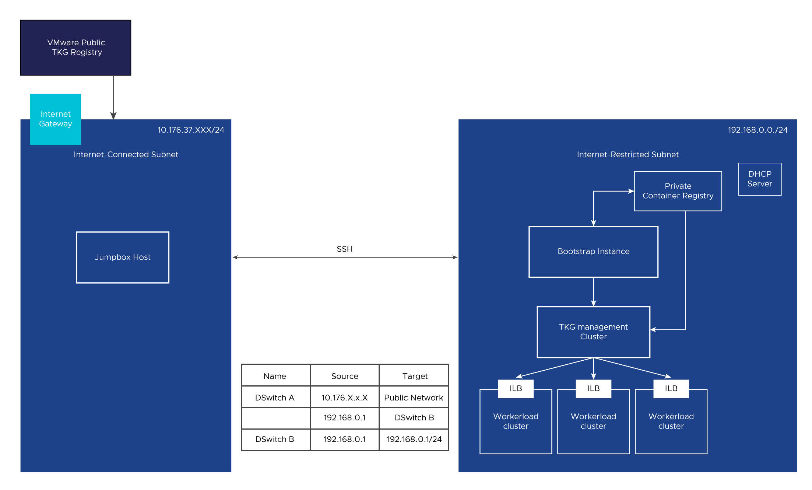

# Prepare to Run Day-0 Tekton Pipelines for Tanzu Kubernetes Grid in Internet-Restricted Environment

Complete the following preparatory tasks for running Tekton pipelines for Tanzu Kubernetes Grid in Internet-restricted environments.

## vSphere Prerequisites and Architecture



## Prerequisites for Tekton Infrastructure

- SIVT VM or Linux VM (with Docker and Kind binary) - bootstrap instance (as mentioned in above diagram)
- VM with internet connectivity - Jumpbox host (as mentioned in above diagram)
  - Required to generate Tekton Docker image, download Tekton dependencies tar
- Git is accessible on above bootstrap VM using https
  - Required to maintain state files, user input files etc. for Tekton pipelines and it's Tasks
- Harbor is configured, and it is up and running - Private Container Registry (as mentioned in above diagram)
  - Required to host Tekton dependent images

## Prerequisites for Tanzu Kubernetes Grid Deployment

- Avi controller OVAs are present in vCenter's content library
- Photon/Ubuntu OS OVAs are present as template in vCenter

## Step 1: Download Tekton Dependencies tar and Tanzu images on Jumbox Host

- Perform following steps to download Tekton dependencies tar:
  - Go to the link and download Tekton dependencies tar file: 
    - https://marketplace.cloud.vmware.com/services/details/service-installer-for-vmware-tanzu-1?slug=true/sivt_tekton_airgapped_dependencies.tar  
  - Copy this tar to bootstrap VM's $HOME directory using SSH
- Refer to the below link to copy Tanzu images to Harbor:
  https://docs.vmware.com/en/VMware-Tanzu-Kubernetes-Grid/1.6/vmware-tanzu-kubernetes-grid-16/GUID-mgmt-clusters-image-copy-airgapped.html
  
## Step 2: Prepare Tekton Docker Image on Jumpbox Host

Perform following steps to create the Tekton Docker image.

1. Change the directory.
    - `cd $HOME`
2. Create two empty files named `airgapped_tkn_docker_img.py` and `dockerfile`.
    - `touch airgapped_tkn_docker_img.py`
    - `touch dockerfile`
3. Copy the contents of `airgapped_tkn_docker_img.py` and `dockerfile` file from link, https://github.com/vmware-tanzu/service-installer-for-vmware-tanzu/tree/1.4.1-1.6.0/tekton/scripts/pre_setup
4. Run the following commands to generate the Docker image:
   1. `chmod +x airgapped_tkn_docker_img.py`
   2. `python airgapped_tkn_docker_img.py --tkg_version <TKG VERSION> --refresh_token <MARKETPLACE REFRESH TOKEN>`
      - **Example**: python airgapped_tkn_docker_img.py --tkg_version 1.5.4 --refresh_token abcc....asfdf
      - **Output**: Will generate docker image named as `sivt_tekton:v<tkg_version>`. like sivt_tekton:v154
5. Run the following commands to tag the generated Docker image and save as a TAR file.
   1. `docker image tag sivt_tekton:v<tkg_version> <HARBOR_URL>/tekton_dep/sivt_tekton:v<tkg_version>`
       - **Example**: `docker image tag sivt_tekton:v154 <HARBOR_URL>/tekton_dep/sivt_tekton:v154`
       - **Note:** <HARBOR_URL> is the Harbor URL of configured Harbor.
                    `tkg_version` is the desired state Tanzu Kubernetes Grid version without any delimiters. For example: 153, 154, or 160, etc.
   2. `docker save -o sivt_tekton_<TKG_VERSION>.tar <HARBOR_URL>/tekton_dep/sivt_tekton:v<TKG_VERSION>`
   3. Copy the generated tar file to bootstrap VM's $HOME directory using SSH.

## Step 3: Prepare Harbor to Host Tekton Dependencies

1. Log in to Harbor UI.
2. Create a project with the name `tekton_dep` in the Harbor UI to upload Tekton dependencies:
  - <HARBOR_URL>/tekton_dep
  - Set this as a public repository.
  - **Note:** Project name must be restricted to `tekton_dep` only.

## Step 4: Prepare Git Environment to Host Tekton Source Code and User Defined Files

1. Create a private Git (GitLab/GitHub) repository.
2. Clone the code from https://github.com/vmware-tanzu/service-installer-for-vmware-tanzu/tree/1.4.1-1.6.0/tekton
3. Create a Git personal access token (PAT) to be used for later stages.
4. Prepare `deployment-config.json` based on your environment and upload under `config/deployment-config.json` in the private git repo (Refer `sample-json/sample-deployment-config.json`).

   -  Update parameter `tkgCustomImageRepository` to Harbor project from where Tanzu images to be pulled 
   -  Note: Refer the SIVT README.md for creation of JSON files.

5. Update the desired state YAML file.

   -  Browse to the `desired-state` directory in bootstrap VM.
   -  Update the `desired-state.yml` file as below.
      - Set `env` as `vsphere`.
     
      ```
       ----
       version:
         tkgm: 1.5.4
         env: vsphere
       ```

## Step 5: Prepare Bootstrap VM to Install Tekton Pipelines

1. Copy Harbor certificates and key from Harbor server to bootstrap VM at the following path:
    cert_file = "/etc/docker/certs.d/<HARBOR_URL>/<HARBOR_URL>.cert"
    key_file  = "/etc/docker/certs.d/<HARBOR_URL>/<HARBOR_URL>.key"
    ca_file = "/etc/docker/certs.d/<HARBOR_URL>/ca.crt"
2. Run the following commands to push the tagged Docker image to Harbor.

     - `cd $HOME` (Path where Docker tar is copied from Jumphost box in Step 2)
     - `docker load -i sivt_tekton_<TKG_VERSION>.tar`
     - `docker login <HARBOR_URL>`
     - `docker push <HARBOR_URLl>/tekton_dep/sivt_tekton:v<TKG_VERSION>`

3. Clone your private GIT repository using `git clone <private repo url>`.
4. Browse to the location where the Git repository is cloned.
5. Run following commands to upload Tekton dependencies tar in Harbor's `tekton_dep` project
     - `cd scripts/pre_setup`
     - `python airgapped_dependent_tar_processing.py --harbor_url <HARBOR_URL>`
       - Where, HARBOR_URL is Harbor address
       - Note: This will process the Tekton dependent tar `sivt_tekton_airgapped_dependencies.tar` in $HOME directory and push the dependent images to Harbor.
       - When prompted for the Docker login, provide the Docker login credentials of Harbor. This step needs to be done one time only.

6. Update the `values.yaml` file.
     - Refer to descriptions in the  file to update for Internet-restricted environment.

7. Run following commands to update YAML files to support Internet-restricted deployment.
     - `cd scripts\pre_setup`
     - `python airgapped_yaml_update.py`
     - **Note:** This updates YAML files for Tekton pipelines and its tasks.

## Step 6: Installing Tekton Pipelines and Dashboard in Bootstrap VM

This step installs Tekton Pipelines and its dashboard.

1. Browse to the location where the Git repository is cloned.
2. Open `cluster_resources/kind-init-config.yaml` and provide a free port for the nginx service to use.
  
    If you do not specify a port, port 80 is used by default.
        
    ```
     extraPortMappings:
     - containerPort: 80
       hostPort: <PROVIDE FREE PORT like 8085 or 8001>
    ```
   
3. Run the following command.
    ```shell
     ./launch.sh --create-cluster --airgapped
    ``` 
        
    This command creates a `kind` cluster, which is required for the Tekton pipeline.

    Tekton provides a dashboard for monitoring and triggering pipelines from the UI. It is recommended to have the dashboard integrated. This step can be skipped if Tekton dashboard is not required for your environment.

4. Run the folllowing command to deploy the dashboard.
    
    ```shell
     ./launch.sh --deploy-dashboard --airgapped
    ```
    The exposed port is `hostPort` set above in step 2.

Tekton dashboard can be accessed via `http:\\<bootstrap VM IP><hostPort>`

## Step 7: Run Day-0 Tekton Pipelines for Tanzu Kubernetes Grid

1. Run the following command.

   ```shell
   ./launch.sh  --exec-day0
   ```

2. Refer to the below section for monitoring the pipelines.
   - [Monitor Tekton Pipeline Runs, Task Runs, and Pipelines](./docs/monitortekton.md)

[Back to Main](../README.md)